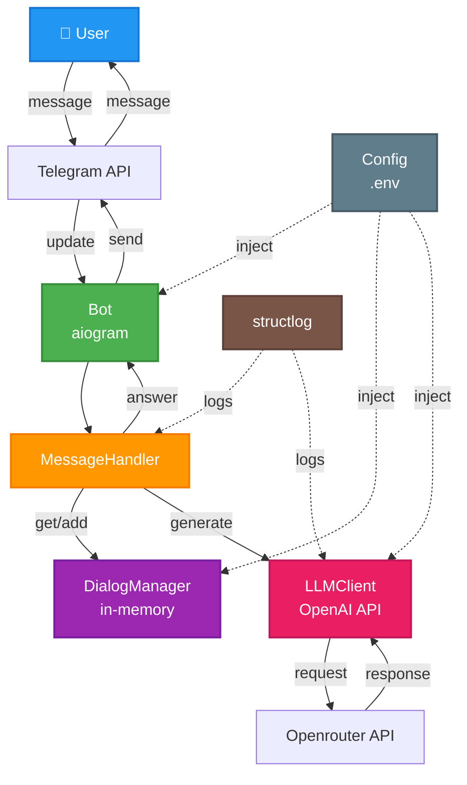
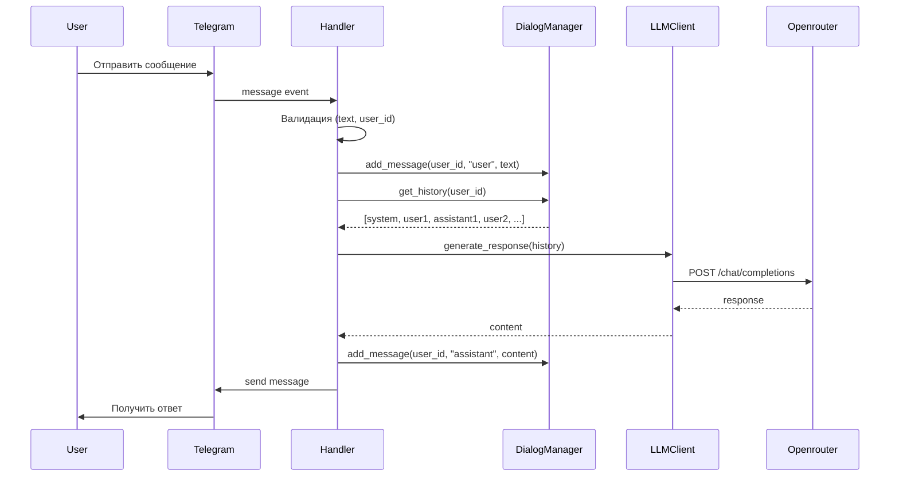

# Architecture Overview

Обзор архитектуры проекта за 15 минут.

## High-Level Архитектура



## Архитектурные принципы

### KISS (Keep It Simple, Stupid)
- Максимальная простота
- Нет избыточной абстракции
- Прямолинейная логика

### Single Responsibility Principle
- 1 класс = 1 файл = 1 ответственность
- `Config` - только конфигурация
- `Bot` - только инициализация aiogram
- `Handler` - только обработка сообщений
- `LLMClient` - только взаимодействие с LLM API
- `DialogManager` - только управление историей

### Async/Await
- Все I/O операции асинхронные
- Telegram API - async
- LLM API - async
- Нет блокирующих операций

### Dependency Injection
- Зависимости передаются через конструктор
- Явная инъекция в `main.py`
- Легкое тестирование (моки)

## Компоненты системы

### 1. Config (`src/config.py`)

**Ответственность**: Загрузка и валидация конфигурации из `.env`

**Ключевые параметры**:
- `TELEGRAM_BOT_TOKEN` - токен бота
- `OPENAI_API_KEY` - ключ API
- `SYSTEM_PROMPT` - загружается из файла или переменной

**Поведение**: Fail Fast - выбрасывает `ValueError` если обязательный параметр отсутствует

### 2. Bot (`src/bot.py`)

**Ответственность**: Инициализация aiogram Bot и Dispatcher

**Что делает**:
- Создаёт `aiogram.Bot` с токеном
- Создаёт `Dispatcher` для обработки обновлений
- Запускает polling через `dp.start_polling()`

### 3. MessageHandler (`src/handler.py`)

**Ответственность**: Обработка команд и текстовых сообщений

**Команды**:
- `/start` - приветствие
- `/role` - показать роль бота
- `/clear` - очистить историю

**Логика обработки текста**:
1. Валидация входных данных
2. Добавить сообщение в историю
3. Отправить историю в LLM
4. Сохранить ответ в историю
5. Отправить ответ пользователю

### 4. DialogManager (`src/dialog_manager.py`)

**Ответственность**: Управление историей диалогов

**Хранение**: In-memory словарь `{user_id: [messages]}`

**Методы**:
- `get_history(user_id)` - получить историю (создать если нет)
- `add_message(user_id, role, content)` - добавить сообщение
- `clear_history(user_id)` - очистить историю
- `_trim_history(history)` - обрезка контекста

**Важно**: История теряется при перезапуске бота

### 5. LLMClient (`src/llm_client.py`)

**Ответственность**: Взаимодействие с LLM через OpenAI-совместимый API

**Провайдер**: Openrouter (можно переключить на OpenAI)

**Обработка ошибок**:
- `OpenAIError` - логируется и пробрасывается
- `TimeoutError` - логируется и пробрасывается

### 6. main.py (`src/main.py`)

**Ответственность**: Точка входа, сборка всех компонентов

**Последовательность**:
1. Загрузить конфигурацию
2. Настроить логирование (structlog)
3. Создать Bot
4. Создать LLMClient, DialogManager
5. Создать MessageHandler, зарегистрировать роутер
6. Запустить polling

## Flow обработки сообщения



## Модель данных

### Формат сообщений (OpenAI API)

```python
Message = {
    "role": "system" | "user" | "assistant",
    "content": str
}
```

### История диалога

```python
[
    {"role": "system", "content": "Ты консультант по музыке..."},
    {"role": "user", "content": "Посоветуй музыку"},
    {"role": "assistant", "content": "Рекомендую..."},
    {"role": "user", "content": "Спасибо"}
]
```

## Обработка ошибок

### На уровне LLMClient
- Логирование ошибок с `exc_info=True`
- Пробрасывание исключения наверх

### На уровне MessageHandler
- Перехват всех исключений
- Логирование с контекстом (user_id)
- Отправка пользователю: "Произошла ошибка, попробуйте позже"

## Логирование

**Библиотека**: structlog (JSON формат)

**Уровни**:
- `INFO` - основные события (bot_started, message_received, llm_request)
- `ERROR` - ошибки API, таймауты

**Вывод**: консоль + файл (logs/)

## Технологический стек

| Компонент | Технология |
|-----------|-----------|
| Telegram Bot | aiogram 3.x |
| LLM API | openai client + Openrouter |
| Конфигурация | python-dotenv |
| Логирование | structlog |
| Async runtime | asyncio |
| Тестирование | pytest + pytest-asyncio |
| Качество кода | ruff + mypy |

## Следующие шаги

- Изучить [Codebase Tour](02_codebase_tour.md) для детального понимания кода
- Прочитать [Data Model](03_data_model.md) для понимания структур данных
- Изучить [Integrations](04_integrations.md) для работы с внешними API
