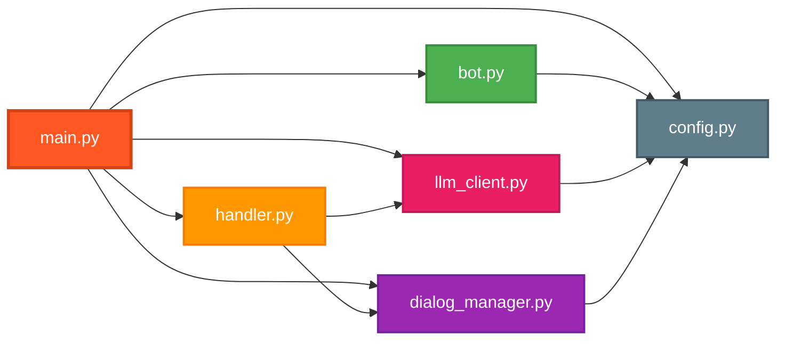

# Codebase Tour

Навигация по коду: где что лежит и за что отвечает.

## Структура проекта

```
telegram-bot/
├── src/                    # Исходный код
│   ├── main.py            # 🚀 Точка входа
│   ├── config.py          # ⚙️ Конфигурация
│   ├── bot.py             # 🤖 Инициализация aiogram
│   ├── handler.py         # 📨 Обработка сообщений
│   ├── llm_client.py      # 🧠 LLM API клиент
│   └── dialog_manager.py  # 💬 Управление историей
├── tests/                 # Тесты
│   ├── conftest.py        # Общие fixtures
│   ├── unit/              # Unit-тесты
│   └── integration/       # Integration-тесты
├── prompts/               # Системные промпты
│   └── music_consultant.txt
├── docs/                  # Документация
│   ├── guides/            # Гайды
│   ├── tasklists/         # Планы работ по спринтам
│   ├── vision.md          # Техническое видение
│   └── roadmap.md         # Roadmap проекта
├── logs/                  # Логи (в .gitignore)
├── .env                   # Секреты (в .gitignore)
├── .env.example           # Шаблон конфигурации
├── pyproject.toml         # Зависимости и настройки
├── Makefile               # Команды автоматизации
└── README.md              # Основное описание
```

## Карта модулей



## src/ - Исходный код

### main.py (72 строки)

**Назначение**: Точка входа приложения

**Основные функции**:
- `setup_logging(config)` - настройка structlog
- `async main()` - создание и запуск всех компонентов

**Последовательность**:
1. Загрузить Config
2. Настроить логирование
3. Создать Bot, LLMClient, DialogManager, MessageHandler
4. Зарегистрировать роутер
5. Запустить polling

**Запуск**: `python -m src.main`

---

### config.py (82 строки)

**Назначение**: Загрузка и валидация конфигурации из `.env`

**Класс**: `Config`

**Ключевые методы**:
- `__init__()` - загрузка всех параметров
- `_get_required(key)` - получить обязательный параметр (Fail Fast)
- `_load_system_prompt()` - загрузить промпт из файла или env

**Параметры**:
```python
TELEGRAM_BOT_TOKEN: str          # обязательный
OPENAI_API_KEY: str              # обязательный
SYSTEM_PROMPT: str               # из файла или env
OPENAI_BASE_URL: str             # default: openrouter
OPENAI_MODEL: str                # default: gpt-4
BOT_ROLE_NAME: str               # default: "ИИ-ассистент"
BOT_ROLE_DESCRIPTION: str        # default: "Помогаю..."
LOG_LEVEL: str                   # default: "INFO"
LOG_FILE_PATH: str               # default: "logs/"
MAX_CONTEXT_MESSAGES: int        # default: 0 (без ограничений)
```

**Что проверять при изменении**:
- Добавляя новый параметр: обновить `__init__()` и `.env.example`
- Обязательный параметр: использовать `_get_required()`
- Опциональный: использовать `os.getenv(key, default)`

---

### bot.py (25 строк)

**Назначение**: Инициализация aiogram Bot и Dispatcher

**Класс**: `Bot`

**Методы**:
- `__init__(config)` - создание aiogram.Bot и Dispatcher
- `async start()` - запуск polling

**Простота**: Минимальная обёртка над aiogram

---

### handler.py (105 строк)

**Назначение**: Обработка команд и сообщений Telegram

**Класс**: `MessageHandler`

**Зависимости**: LLMClient, DialogManager, Logger

**Методы-обработчики**:
- `handle_start(message)` - команда `/start`
- `handle_role(message)` - команда `/role`
- `handle_clear(message)` - команда `/clear`
- `handle_text(message)` - текстовые сообщения

**Регистрация**: `_register_handlers()` связывает методы с командами/фильтрами

**Обработка ошибок**:
```python
try:
    # работа с LLM
except Exception as e:
    logger.error("llm_error", ...)
    await message.answer("Произошла ошибка...")
```

**Что проверять при изменении**:
- Добавляя команду: создать метод + зарегистрировать в `_register_handlers()`
- Валидация: проверять `message.text` и `message.from_user` на None

---

### llm_client.py (59 строк)

**Назначение**: Взаимодействие с LLM через OpenAI API

**Класс**: `LLMClient`

**Зависимости**: Config, Logger

**Основной метод**:
```python
async def generate_response(messages: list[dict]) -> str:
    # Логировать запрос
    # Вызвать client.chat.completions.create()
    # Обработать ошибки (OpenAIError, TimeoutError)
    # Логировать ответ
    # Вернуть content
```

**API клиент**:
```python
self.client = AsyncOpenAI(
    base_url=config.OPENAI_BASE_URL,
    api_key=config.OPENAI_API_KEY
)
```

**Что проверять при изменении**:
- Смена провайдера: изменить `OPENAI_BASE_URL` в .env
- Новые параметры API: добавить в `create()` call
- Обработка ошибок: логировать + re-raise

---

### dialog_manager.py (91 строка)

**Назначение**: Управление историей диалогов в памяти

**Класс**: `DialogManager`

**Хранилище**:
```python
dialogs: dict[int, list[dict[str, Any]]] = {}
# {user_id: [{role, content}, ...]}
```

**Методы**:
- `get_history(user_id)` - получить историю, создать если нет, применить обрезку
- `add_message(user_id, role, content)` - добавить сообщение
- `clear_history(user_id)` - удалить историю
- `_trim_history(history)` - обрезать до MAX_CONTEXT_MESSAGES

**Логика обрезки**:
```python
# Сохранить: system prompt + последние N*2 сообщений (пары user+assistant)
# Если MAX_CONTEXT_MESSAGES=2: system + последние 4 сообщения
```

**Важно**: In-memory хранение - данные теряются при перезапуске

**Что проверять при изменении**:
- Миграция на БД: заменить `dialogs: dict` на DB repository
- Логика обрезки: тестировать `_trim_history()` с разными MAX_CONTEXT_MESSAGES

---

## tests/ - Тесты

### conftest.py

**Назначение**: Общие pytest fixtures

**Fixtures**:
- `config` - мокированная Config через monkeypatch
- `config_with_max_context` - Config с MAX_CONTEXT_MESSAGES=2
- `dialog_manager` - DialogManager с тестовой Config
- `logger` - мокированный structlog.BoundLogger

---

### tests/unit/

**Unit-тесты для отдельных компонентов**:

- `test_config.py` - тесты Config (загрузка, валидация, дефолты)
- `test_dialog_manager.py` - тесты DialogManager (история, обрезка)
- `test_llm_client.py` - тесты LLMClient (моки AsyncOpenAI)

---

### tests/integration/

**Integration-тесты взаимодействия**:

- `test_handler.py` - тесты MessageHandler с моками зависимостей

---

## prompts/ - Системные промпты

### music_consultant.txt

**Назначение**: Системный промпт для текущей роли бота

**Использование**: загружается Config при старте через `SYSTEM_PROMPT_FILE`

**Изменение роли**: отредактировать этот файл или создать новый + изменить .env

---

## docs/ - Документация

### vision.md

Техническое видение: архитектура, технологии, модель данных, сценарии работы

### roadmap.md

Roadmap проекта по спринтам с общим планом развития

### tasklists/

Детальные планы работ для каждого спринта:
- `tasklist-s0.md` - основной функционал спринта 0 (MVP)
- `tasklist_tech_debt-s0.md` - технический долг спринта 0

### guides/

Гайды для онбординга (этот файл - один из них)

---

## Конфигурационные файлы

### pyproject.toml

**Содержит**:
- `[project]` - метаданные, зависимости
- `[tool.ruff]` - настройки линтера/форматтера
- `[tool.mypy]` - настройки type checker
- `[tool.coverage]` - настройки coverage
- `[dependency-groups]` - dev зависимости

### Makefile

**Команды**:
```makefile
make install    # uv sync
make run        # запуск бота
make format     # ruff format
make lint       # ruff + mypy
make fix        # ruff --fix
make test       # pytest
make test-cov   # pytest + coverage
```

### .env.example

Шаблон для создания `.env` с примерами всех параметров

---

## Быстрая навигация

| Нужно... | Иди в... |
|----------|----------|
| Изменить роль бота | `prompts/music_consultant.txt` |
| Добавить параметр конфигурации | `src/config.py` + `.env.example` |
| Добавить команду бота | `src/handler.py` → создать метод + зарегистрировать |
| Изменить модель LLM | `.env` → `OPENAI_MODEL` |
| Посмотреть логи | `logs/` директория |
| Добавить тест | `tests/unit/` или `tests/integration/` |
| Изменить обрезку контекста | `src/dialog_manager.py` → `_trim_history()` |
| Сменить LLM провайдера | `.env` → `OPENAI_BASE_URL` |

## Следующие шаги

- Изучить [Data Model](03_data_model.md) для понимания структур данных
- Прочитать [Configuration & Secrets](05_configuration_secrets.md) для настройки
- Посмотреть [Development Workflow](06_development_workflow.md) для разработки
