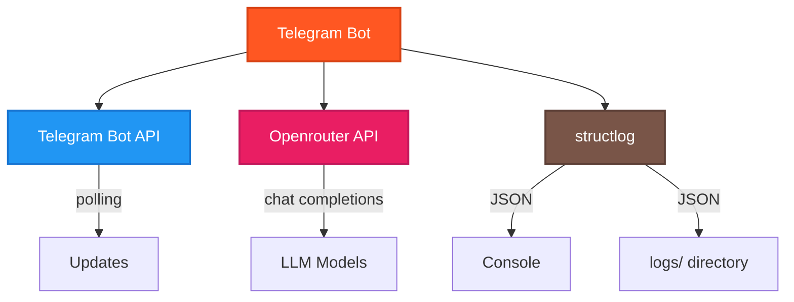
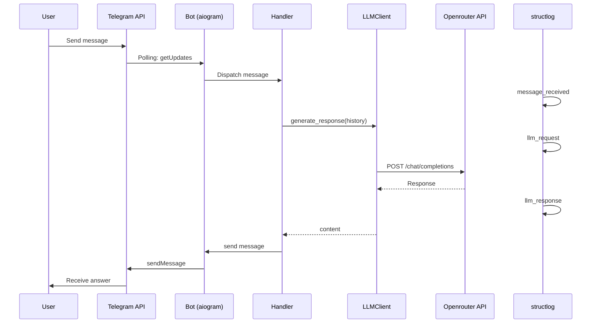

# Integrations

Внешние интеграции проекта.

## Обзор интеграций



## 1. Telegram Bot API

### Библиотека: aiogram 3.x

**Документация**: https://docs.aiogram.dev/en/latest/

**Использование в проекте**: `src/bot.py`, `src/handler.py`

### Метод получения обновлений: Polling

```python
# src/bot.py
async def start(self) -> None:
    await self.dp.start_polling(self.bot)
```

**Polling** - бот опрашивает Telegram API на наличие новых сообщений.

**Альтернатива**: Webhooks (не реализовано)

### Обработка обновлений

**Router-based подход**:
```python
# src/handler.py
self.router = Router()
self.router.message.register(self.handle_start, Command("start"))
self.router.message.register(self.handle_text)
```

### Типы сообщений

**Обрабатываются**:
- Команды: `/start`, `/role`, `/clear`
- Текстовые сообщения

**Игнорируются**:
- Медиафайлы (фото, видео, документы)
- Стикеры, голосовые, локации

**Валидация**:
```python
if not message.text:
    return  # Игнорировать
```

### Rate Limits

Telegram Bot API имеет лимиты:
- **30 сообщений/секунду** для одного чата
- **1 сообщение/секунду** для одного пользователя (для новых ботов)

**Проект не обрабатывает rate limits** - для MVP достаточно.

## 2. Openrouter API

### OpenAI-совместимый API

**Документация**: https://openrouter.ai/docs

**Base URL**: `https://openrouter.ai/api/v1`

**Использование в проекте**: `src/llm_client.py`

### Клиент: openai library

```python
from openai import AsyncOpenAI

client = AsyncOpenAI(
    base_url="https://openrouter.ai/api/v1",
    api_key=config.OPENAI_API_KEY
)
```

### Chat Completions

**Метод**: `POST /chat/completions`

**Запрос**:
```python
response = await client.chat.completions.create(
    model="openai/gpt-4",
    messages=[
        {"role": "system", "content": "..."},
        {"role": "user", "content": "..."}
    ]
)
```

**Ответ**:
```python
content = response.choices[0].message.content
```

### Модели

**Текущая модель**: `openai/gpt-4` (из `.env`)

**Доступные модели**: https://openrouter.ai/models

**Смена модели**: изменить `OPENAI_MODEL` в `.env`

Примеры:
- `openai/gpt-3.5-turbo` - дешевле, быстрее
- `anthropic/claude-3-sonnet` - Claude от Anthropic
- `meta-llama/llama-3-70b-instruct` - Llama 3

### Обработка ошибок

**OpenAIError**:
```python
from openai import OpenAIError

try:
    response = await client.chat.completions.create(...)
except OpenAIError as e:
    # Ошибки API: неверный ключ, превышен лимит, недоступность
    logger.error("llm_api_error", error=str(e))
    raise
```

**TimeoutError**:
```python
except TimeoutError as e:
    # Таймаут сети
    logger.error("llm_timeout_error", error=str(e))
    raise
```

### Rate Limits и Credits

Openrouter использует систему кредитов:
- При регистрации дается бесплатный кредит
- Разные модели стоят по-разному
- При исчерпании кредита - ошибка API

**Проверка баланса**: https://openrouter.ai/credits

### Переключение на OpenAI напрямую

Изменить в `.env`:
```env
OPENAI_BASE_URL=https://api.openai.com/v1
OPENAI_API_KEY=sk-...  # ключ от OpenAI
OPENAI_MODEL=gpt-4
```

Код не требует изменений - API совместим.

## 3. Логирование (structlog)

### Библиотека: structlog

**Документация**: https://www.structlog.org/

**Использование в проекте**: `src/main.py`

### Настройка

```python
structlog.configure(
    processors=[
        structlog.processors.TimeStamper(fmt="iso"),
        structlog.processors.add_log_level,
        structlog.processors.JSONRenderer(),
    ],
    logger_factory=structlog.PrintLoggerFactory(),
)
```

### Формат: JSON

**Пример лога**:
```json
{"event":"bot_started","timestamp":"2025-10-16T12:00:00","level":"info","model":"openai/gpt-4"}
```

### Вывод

**Консоль** (stdout):
```python
logger_factory=structlog.PrintLoggerFactory()
```

**Файл**: Создается директория `logs/` но файловый вывод не настроен.

### Уровни логирования

Из `.env`:
```env
LOG_LEVEL=INFO
```

**Доступные уровни**:
- `DEBUG` - детальная информация
- `INFO` - основные события (по умолчанию)
- `WARNING` - предупреждения
- `ERROR` - ошибки

### События логирования

| Событие | Уровень | Где | Контекст |
|---------|---------|-----|----------|
| `bot_started` | INFO | main.py | model |
| `message_received` | INFO | handler.py | user_id, text |
| `llm_request` | INFO | llm_client.py | model, message_count |
| `llm_response` | INFO | llm_client.py | length |
| `llm_api_error` | ERROR | llm_client.py | error, exc_info |
| `llm_timeout_error` | ERROR | llm_client.py | error, exc_info |
| `llm_error` | ERROR | handler.py | user_id, error, exc_info |

## 4. In-Memory Storage

### Dict хранилище

**Реализация**: `src/dialog_manager.py`

```python
dialogs: dict[int, list[dict[str, Any]]] = {}
```

**Преимущества**:
- Простота
- Быстрота
- Нет внешних зависимостей

**Недостатки**:
- Данные теряются при перезапуске
- Ограничено памятью
- Нет персистентности

**Когда это проблема**:
- Production окружение с частыми деплоями
- Множество пользователей с длинными диалогами
- Необходимость аналитики истории

**Текущий статус**: Достаточно для MVP и разработки.

## Интеграционная диаграмма



## API Keys и Authentication

### Telegram Bot Token

**Формат**: `123456:ABC-DEF1234ghIkl-zyx57W2v1u123ew11`

**Получение**: [@BotFather](https://t.me/BotFather)

**Где хранится**: `.env` → `TELEGRAM_BOT_TOKEN`

**Использование**: `aiogram.Bot(token=...)`

### Openrouter API Key

**Формат**: `sk-or-v1-xxxxxxxxxxxxxxxxxxxxx`

**Получение**: https://openrouter.ai/keys

**Где хранится**: `.env` → `OPENAI_API_KEY`

**Использование**: `AsyncOpenAI(api_key=...)`

## Network & Connectivity

### Зависимости от сети

Бот требует постоянного подключения к интернету:
1. Telegram API - получение сообщений (polling)
2. Openrouter API - генерация ответов

**Если нет интернета**: бот не работает

### Обработка сетевых ошибок

**Telegram API**: aiogram автоматически переподключается при разрыве

**Openrouter API**:
```python
try:
    response = await client.chat.completions.create(...)
except TimeoutError:
    # Логируется, пользователь получает "Ошибка, попробуйте позже"
    ...
```

## Следующие шаги

- Изучить [Configuration & Secrets](05_configuration_secrets.md) для настройки API ключей
- Прочитать [Development Workflow](06_development_workflow.md) для тестирования интеграций
- Посмотреть [Troubleshooting](10_troubleshooting.md) для решения проблем с API
