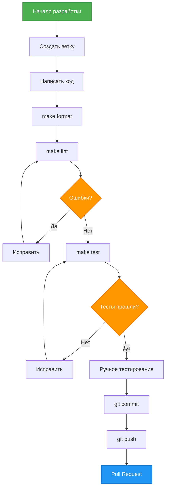
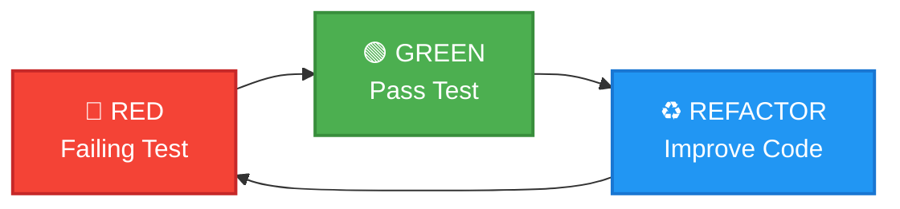

# Development Workflow

Процесс разработки новых фич.

## Общий workflow



## Создание ветки

### Naming convention

```bash
# Feature
git checkout -b feature/add-voice-messages

# Bugfix
git checkout -b fix/memory-leak-dialog-manager

# Refactoring
git checkout -b refactor/split-dialog-manager
```

## Makefile команды

### make install

Установка зависимостей:
```bash
make install
```

Выполняет: `uv sync`

### make run

Запуск бота:
```bash
make run
```

Выполняет: `uv run python -m src.main`

### make format

Автоформатирование кода:
```bash
make format
```

Выполняет: `uv run ruff format src/`

**Использовать**: перед коммитом

### make lint

Проверка качества кода:
```bash
make lint
```

Выполняет: `uv run ruff check src/ && uv run mypy src/`

**Цель**: 0 ошибок

### make fix

Автоисправление простых ошибок:
```bash
make fix
```

Выполняет: `uv run ruff check src/ --fix`

**Что исправляет**:
- Неиспользуемые импорты
- Сортировка импортов
- Простые style issues

### make test

Запуск тестов:
```bash
make test
```

Выполняет: `uv run pytest tests/ -v`

### make test-cov

Тесты с coverage:
```bash
make test-cov
```

Выполняет: `uv run pytest tests/ -v --cov=src --cov-report=term-missing`

**Цель**: >= 60% (текущий минимум)

## Code Style

### ruff (форматтер + линтер)

**Конфигурация**: `pyproject.toml`

```toml
[tool.ruff]
line-length = 120
target-version = "py311"

[tool.ruff.lint]
select = ["E", "F", "I", "N", "UP", "B", "C4", "SIM", "TCH"]
ignore = ["E501"]
```

**Правила**:
- **E**: PEP 8 errors
- **F**: pyflakes (unused imports, variables)
- **I**: isort (сортировка импортов)
- **N**: naming conventions
- **UP**: pyupgrade (современный Python синтаксис)
- **B**: bugbear (баги и антипаттерны)
- **C4**: comprehensions
- **SIM**: simplify (упрощение кода)
- **TCH**: type checking

### mypy (type checker)

**Конфигурация**: `pyproject.toml`

```toml
[tool.mypy]
python_version = "3.11"
strict = true
disallow_untyped_defs = true
```

**Требования**:
- Все функции имеют type hints
- Strict mode (максимальная строгость)

**Пример**:
```python
# ✅ Правильно
def get_history(self, user_id: int) -> list[dict[str, Any]]:
    ...

# ❌ Неправильно (нет type hints)
def get_history(self, user_id):
    ...
```

## TDD (для новых компонентов)

### Red-Green-Refactor



### Когда использовать TDD

**Использовать**:
- Новый класс с бизнес-логикой
- Сложная логика (например, `_trim_history()`)
- API клиенты
- Критичные компоненты

**Не использовать**:
- Простые обертки
- UI handlers (сложно тестировать)
- Быстрые прототипы

### Пример TDD

**1. RED - Failing Test**:
```python
# tests/unit/test_new_feature.py
def test_new_method_returns_correct_value():
    obj = MyClass()
    result = obj.new_method(input_data)
    assert result == expected_output
```

Запустить: `make test` → ❌ FAILED (метод не существует)

**2. GREEN - Minimal Implementation**:
```python
# src/my_class.py
def new_method(self, input_data):
    return expected_output  # минимальная реализация
```

Запустить: `make test` → ✅ PASSED

**3. REFACTOR - Improve**:
```python
def new_method(self, input_data):
    # правильная реализация
    processed = self._process(input_data)
    return self._format(processed)
```

Запустить: `make test` → ✅ PASSED

## Примеры задач

### Добавить новую команду /help

**1. Создать метод в handler.py**:
```python
async def handle_help(self, message: Message) -> None:
    """Обработчик команды /help"""
    help_text = "Доступные команды:\n/start - начать\n/clear - очистить"
    await message.answer(help_text)
```

**2. Зарегистрировать в _register_handlers()**:
```python
self.router.message.register(self.handle_help, Command("help"))
```

**3. Проверить**:
```bash
make format
make lint
make run
# Отправить /help в бота
```

### Изменить системный промпт

**1. Отредактировать файл**:
```bash
nano prompts/music_consultant.txt
```

**2. Перезапустить бота**:
```bash
make run
```

**3. Проверить**:
- Отправить `/clear` (очистить старую историю)
- Отправить новое сообщение
- Проверить что бот ведет себя согласно новому промпту

### Добавить новый параметр конфигурации

**1. Обновить src/config.py**:
```python
self.TIMEOUT_SECONDS: int = int(os.getenv("TIMEOUT_SECONDS", "30"))
```

**2. Обновить .env.example**:
```env
# Request timeout (seconds)
TIMEOUT_SECONDS=30
```

**3. Использовать в коде**:
```python
response = await client.chat.completions.create(
    ...,
    timeout=self.config.TIMEOUT_SECONDS
)
```

**4. Добавить тест**:
```python
def test_config_loads_timeout_seconds(monkeypatch, config):
    assert config.TIMEOUT_SECONDS == 30  # default
```

**5. Проверить**:
```bash
make format
make lint
make test
```

### Добавить обработку ошибок

**Пример**: обработка превышения rate limit

**1. Импортировать исключение**:
```python
from openai import RateLimitError
```

**2. Добавить обработку в llm_client.py**:
```python
try:
    response = await client.chat.completions.create(...)
except RateLimitError as e:
    self.logger.error("llm_rate_limit_error", error=str(e))
    raise
```

**3. Обработать в handler.py**:
```python
except Exception as e:
    if "rate limit" in str(e).lower():
        await message.answer("Слишком много запросов. Подождите немного.")
    else:
        await message.answer("Произошла ошибка, попробуйте позже")
```

**4. Добавить тест**:
```python
@pytest.mark.asyncio
async def test_llm_client_handles_rate_limit(llm_client, mock_openai):
    mock_openai.chat.completions.create.side_effect = RateLimitError("Too many requests")

    with pytest.raises(RateLimitError):
        await llm_client.generate_response([{"role": "user", "content": "Hi"}])
```

## Ручное тестирование

### Запуск бота

```bash
make run
```

### Чеклист тестирования

- [ ] `/start` - приветствие отображается
- [ ] `/role` - роль отображается корректно
- [ ] `/clear` - история очищается
- [ ] Обычное сообщение - бот отвечает в роли
- [ ] Несколько сообщений - бот помнит контекст
- [ ] После `/clear` - бот не помнит старый контекст
- [ ] Логи в консоли - нет ошибок
- [ ] Проверить logs/ директорию

### Debug логи

**Включить**:
```env
LOG_LEVEL=DEBUG
```

**Проверить**:
```bash
make run
# Отправить сообщение
# Проверить детальные логи в консоли
```

## Коммиты

### Commit message format

```
<type>: <краткое описание>

<детальное описание (опционально)>
```

**Types**:
- `feat:` - новая фича
- `fix:` - исправление бага
- `refactor:` - рефакторинг
- `test:` - добавление тестов
- `docs:` - обновление документации
- `chore:` - обслуживание (зависимости, конфиг)

**Примеры**:
```bash
git commit -m "feat: add /help command"
git commit -m "fix: handle rate limit errors in LLMClient"
git commit -m "refactor: split DialogManager into repository and service"
git commit -m "test: add tests for context trimming"
git commit -m "docs: update configuration guide"
```

### Pre-commit checklist

Перед коммитом:
```bash
make format  # автоформатирование
make lint    # проверка качества (должно быть 0 ошибок)
make test    # тесты должны проходить
```

## Pull Request

### Создание PR

```bash
git push origin feature/my-feature
# Создать PR на GitHub/GitLab
```

### Описание PR

**Шаблон**:
```markdown
## Что изменено
- Добавлена команда /help
- Обновлена документация

## Тестирование
- [x] make lint прошел
- [x] make test прошел
- [x] Ручное тестирование выполнено

## Скриншоты (если UI)
...
```

## Следующие шаги

- Изучить [Testing Guide](07_testing_guide.md) для написания тестов
- Прочитать [Code Review Guide](08_code_review_guide.md) для ревью
- Посмотреть [Troubleshooting](10_troubleshooting.md) при возникновении проблем
