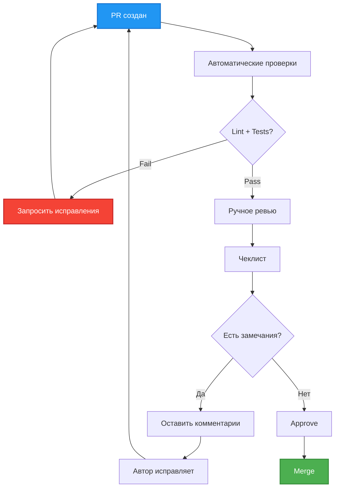

# Code Review Guide

Что проверять при ревью кода.

## Чеклист ревьюера

### 1. Соответствие архитектуре

**Проверить**:
- [ ] Следует принципу "1 класс = 1 файл"
- [ ] Соблюдается Single Responsibility Principle
- [ ] Нет нарушений KISS (избыточной абстракции)
- [ ] Dependency Injection через конструктор
- [ ] Async/await для всех I/O операций

**Ссылки**: `docs/vision.md`, `.cursorrules`

### 2. Type Hints

**Проверить**:
- [ ] Все функции имеют аннотации типов
- [ ] Аннотации для параметров и возвращаемых значений
- [ ] Используются современные типы: `list[str]` вместо `List[str]`
- [ ] `mypy strict` проходит без ошибок

**Примеры**:

```python
# ✅ Правильно
def get_history(self, user_id: int) -> list[dict[str, Any]]:
    ...

# ❌ Неправильно
def get_history(self, user_id):
    ...
```

### 3. Docstrings

**Проверить**:
- [ ] Все публичные методы имеют docstrings
- [ ] Описаны параметры (Args)
- [ ] Описано возвращаемое значение (Returns)
- [ ] Описаны исключения (Raises)

**Формат**:

```python
def method(self, param: str) -> int:
    """Краткое описание метода

    Args:
        param: Описание параметра

    Returns:
        Описание возвращаемого значения

    Raises:
        ValueError: Когда выбрасывается
    """
    ...
```

### 4. Error Handling

**Проверить**:
- [ ] Все внешние вызовы обернуты в try/except
- [ ] Ошибки логируются с `exc_info=True`
- [ ] Fail Fast для критичных ошибок (Config)
- [ ] Пользовательские сообщения об ошибках понятны

**Примеры**:

```python
# ✅ Правильно
try:
    response = await client.chat.completions.create(...)
except OpenAIError as e:
    self.logger.error("llm_api_error", error=str(e), exc_info=True)
    raise

# ❌ Неправильно
try:
    response = await client.chat.completions.create(...)
except:
    pass  # Silent failure
```

### 5. Валидация входных данных

**Проверить**:
- [ ] Проверка на None перед использованием
- [ ] Early return при невалидных данных
- [ ] Явные проверки: `if value is None:` вместо `if not value:`

**Примеры**:

```python
# ✅ Правильно
if not message.text:
    return
# основная логика

# ❌ Неправильно
if message.text:
    # основная логика в глубокой вложенности
```

### 6. Тестирование

**Проверить**:
- [ ] Добавлены тесты для новой функциональности
- [ ] Coverage >= 60% (для критичных компонентов >= 80%)
- [ ] Тесты проходят: `make test`
- [ ] Тесты имеют понятные имена и docstrings
- [ ] Используются моки для внешних зависимостей

**Примеры**:

```python
# ✅ Правильно
def test_get_history_creates_new_history_with_system_prompt():
    """Тест: get_history() создаёт новую историю с системным промптом"""
    ...

# ❌ Неправильно
def test1():
    ...
```

### 7. Code Style

**Проверить**:
- [ ] `make format` применен
- [ ] `make lint` проходит без ошибок (0 issues)
- [ ] Длина строки <= 120 символов
- [ ] Импорты отсортированы (isort)
- [ ] Нет неиспользуемых импортов

**Автоматическая проверка**:
```bash
make lint
```

### 8. Логирование

**Проверить**:
- [ ] Важные события логируются
- [ ] Используется structlog с контекстом
- [ ] Уровни логов корректны (INFO/ERROR)
- [ ] Нет избыточного логирования

**Примеры**:

```python
# ✅ Правильно
self.logger.info("message_received", user_id=user_id, text=message.text)

# ❌ Неправильно
print(f"Message: {message.text}")  # Использование print
```

### 9. Производительность

**Проверить**:
- [ ] Нет блокирующих синхронных операций в async коде
- [ ] Используется `await` для всех async вызовов
- [ ] Нет O(n²) алгоритмов без необходимости
- [ ] Нет избыточных копирований данных

**Примеры**:

```python
# ✅ Правильно
response = await client.chat.completions.create(...)

# ❌ Неправильно
response = client.chat.completions.create(...)  # Забыли await
```

### 10. Безопасность

**Проверить**:
- [ ] Нет хардкода секретов/токенов
- [ ] API ключи загружаются из .env
- [ ] Нет SQL injection (если есть БД)
- [ ] Пользовательский ввод валидируется

### 11. Документация

**Проверить**:
- [ ] README обновлен (если нужно)
- [ ] Обновлен .env.example (новые параметры)
- [ ] Обновлены гайды (если изменилась архитектура)
- [ ] Комментарии в коде понятны

## Процесс ревью



## Комментарии в PR

### Форматирование комментариев

**Категории**:
- `[CRITICAL]` - блокирующие проблемы (баги, security)
- `[MAJOR]` - важные замечания (архитектура, производительность)
- `[MINOR]` - улучшения (стиль, naming)
- `[QUESTION]` - вопросы для обсуждения

**Примеры**:

```markdown
[CRITICAL] Нет проверки на None перед использованием `message.text`.
Это приведет к ошибке если пользователь отправит медиафайл.

Добавить:
if not message.text:
    return
```

```markdown
[MAJOR] Метод `_process_data()` нарушает SRP - делает и валидацию, и трансформацию.
Предлагаю разделить на `_validate_data()` и `_transform_data()`.
```

```markdown
[MINOR] Имя переменной `x` не информативно.
Предлагаю переименовать в `user_id` для ясности.
```

```markdown
[QUESTION] Почему используется синхронный вызов вместо async?
Есть ли блокирующая операция?
```

## Примеры ревью

### Пример 1: Новая команда

**PR**: Добавить команду `/help`

**Проверить**:
- [ ] Метод `handle_help()` добавлен в `handler.py`
- [ ] Команда зарегистрирована в `_register_handlers()`
- [ ] Добавлен тест `test_handle_help_sends_help_text()`
- [ ] Docstring описывает метод
- [ ] Type hints присутствуют
- [ ] `make lint` проходит
- [ ] Ручное тестирование выполнено (скриншот в PR)

### Пример 2: Обработка ошибок

**PR**: Добавить обработку rate limit ошибок

**Проверить**:
- [ ] Импортирован `RateLimitError` из `openai`
- [ ] Добавлен except блок в `llm_client.py`
- [ ] Ошибка логируется с `exc_info=True`
- [ ] Пользователю отправляется понятное сообщение
- [ ] Добавлен тест с моком `RateLimitError`
- [ ] Тест проверяет логирование

### Пример 3: Рефакторинг

**PR**: Разделить DialogManager на Repository и Service

**Проверить**:
- [ ] Следует архитектуре из `vision.md`
- [ ] Создан `dialog_repository.py` (хранение)
- [ ] Создан `dialog_context_service.py` (логика)
- [ ] DialogManager теперь фасад
- [ ] Обновлены все тесты
- [ ] Coverage не снизился
- [ ] Функциональность не изменилась (регрессионные тесты)
- [ ] Обновлены гайды (если нужно)

## Автоматизация ревью

### Pre-commit hooks (будущее)

```bash
# .pre-commit-config.yaml
repos:
  - repo: local
    hooks:
      - id: format
        name: ruff format
        entry: make format
      - id: lint
        name: ruff + mypy
        entry: make lint
      - id: test
        name: pytest
        entry: make test
```

### GitHub Actions (будущее)

```yaml
# .github/workflows/pr.yml
name: PR Checks
on: [pull_request]
jobs:
  quality:
    runs-on: ubuntu-latest
    steps:
      - uses: actions/checkout@v2
      - name: Install
        run: make install
      - name: Lint
        run: make lint
      - name: Test
        run: make test-cov
```

## Общие ошибки

### 1. Забыли await

```python
# ❌ Неправильно
response = client.chat.completions.create(...)

# ✅ Правильно
response = await client.chat.completions.create(...)
```

### 2. Игнорирование ошибок

```python
# ❌ Неправильно
try:
    ...
except Exception:
    pass

# ✅ Правильно
try:
    ...
except OpenAIError as e:
    logger.error("error", exc_info=True)
    raise
```

### 3. Отсутствие валидации

```python
# ❌ Неправильно
user_id = message.from_user.id  # может быть None

# ✅ Правильно
if not message.from_user:
    return
user_id = message.from_user.id
```

### 4. Нет type hints

```python
# ❌ Неправильно
def process(data):
    return data

# ✅ Правильно
def process(data: str) -> str:
    return data
```

### 5. Неинформативные имена

```python
# ❌ Неправильно
def f(x, y):
    return x + y

# ✅ Правильно
def add_message_to_history(user_id: int, message: str) -> None:
    ...
```

## Следующие шаги

- Изучить [CI/CD Basics](09_cicd_basics.md) для автоматизации проверок
- Прочитать [Development Workflow](06_development_workflow.md) для процесса разработки
- Посмотреть [Testing Guide](07_testing_guide.md) для требований к тестам
