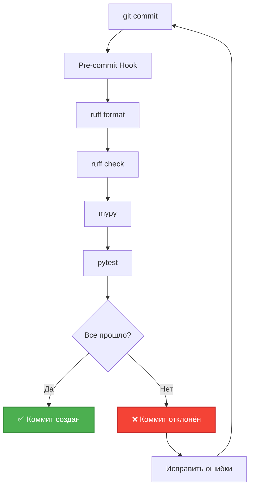

# CI/CD Basics

Автоматизация проверок и деплоя (текущее состояние и план).

## Текущее состояние

**Статус**: Все проверки выполняются **вручную** через Makefile.

### Что есть сейчас


### Команды Makefile

| Команда | Действие | Когда использовать |
|---------|----------|-------------------|
| `make format` | Автоформатирование (ruff format) | Перед коммитом |
| `make lint` | Проверка качества (ruff + mypy) | Перед коммитом |
| `make test` | Запуск тестов | Перед коммитом |
| `make test-cov` | Тесты + coverage | Перед PR |

### Ручной workflow

**Перед коммитом**:
```bash
make format
make lint
make test
git commit -m "feat: ..."
git push
```

**Проблемы**:
- ❌ Можно забыть запустить проверки
- ❌ Нет единого стандарта для всех разработчиков
- ❌ Нет автоматической проверки PR

## Pre-commit Hooks (не реализовано)

### Что такое pre-commit

**Git hook** - скрипт, который запускается автоматически перед коммитом.

### Установка pre-commit

```bash
# Установить библиотеку
uv add --dev pre-commit

# Создать конфигурацию
touch .pre-commit-config.yaml
```

### Конфигурация (.pre-commit-config.yaml)

```yaml
repos:
  - repo: local
    hooks:
      - id: ruff-format
        name: Ruff Format
        entry: uv run ruff format src/
        language: system
        pass_filenames: false

      - id: ruff-check
        name: Ruff Check
        entry: uv run ruff check src/
        language: system
        pass_filenames: false

      - id: mypy
        name: Mypy Type Check
        entry: uv run mypy src/
        language: system
        pass_filenames: false

      - id: pytest
        name: Pytest
        entry: uv run pytest tests/
        language: system
        pass_filenames: false
```

### Активация

```bash
# Установить хуки
pre-commit install

# Теперь перед каждым коммитом автоматически запускаются проверки
```

### Workflow с pre-commit



## GitHub Actions (не реализовано)

### Что такое GitHub Actions

**CI/CD платформа** от GitHub для автоматизации проверок и деплоя.

### PR Checks Workflow

**Файл**: `.github/workflows/pr.yml`

```yaml
name: PR Checks

on:
  pull_request:
    branches: [main, refactoring]

jobs:
  quality:
    runs-on: ubuntu-latest

    steps:
      - name: Checkout code
        uses: actions/checkout@v3

      - name: Setup Python
        uses: actions/setup-python@v4
        with:
          python-version: '3.11'

      - name: Install uv
        run: curl -LsSf https://astral.sh/uv/install.sh | sh

      - name: Install dependencies
        run: make install

      - name: Format check
        run: uv run ruff format --check src/

      - name: Lint
        run: uv run ruff check src/

      - name: Type check
        run: uv run mypy src/

      - name: Test
        run: make test-cov

      - name: Upload coverage
        uses: codecov/codecov-action@v3
        with:
          file: ./coverage.xml
```

### Результат

**На каждый PR**:
- ✅ Автоматически запускаются проверки
- ✅ Виден статус в GitHub (зеленая/красная галочка)
- ✅ PR нельзя смержить если проверки не прошли
- ✅ Coverage отображается в Codecov

## Deployment (не реализовано)

### Текущий запуск

**Статус**: Бот запускается вручную на локальной машине.

```bash
make run
```

**Проблемы**:
- ❌ При закрытии терминала бот останавливается
- ❌ При перезагрузке машины бот не перезапускается
- ❌ История теряется (in-memory storage)

### Варианты деплоя

#### 1. systemd (Linux server)

**Создать service файл**: `/etc/systemd/system/telegram-bot.service`

```ini
[Unit]
Description=Telegram Bot
After=network.target

[Service]
Type=simple
User=botuser
WorkingDirectory=/opt/telegram-bot
ExecStart=/opt/telegram-bot/.venv/bin/python -m src.main
Restart=always

[Install]
WantedBy=multi-user.target
```

**Управление**:
```bash
sudo systemctl start telegram-bot
sudo systemctl enable telegram-bot  # автозапуск
sudo systemctl status telegram-bot
```

#### 2. Docker

**Создать Dockerfile**:
```dockerfile
FROM python:3.11-slim

WORKDIR /app

# Установить uv
RUN pip install uv

# Скопировать файлы
COPY pyproject.toml uv.lock ./
COPY src/ ./src/
COPY prompts/ ./prompts/

# Установить зависимости
RUN uv sync

# Запустить бота
CMD ["uv", "run", "python", "-m", "src.main"]
```

**Запуск**:
```bash
docker build -t telegram-bot .
docker run -d --env-file .env telegram-bot
```

#### 3. Docker Compose

**docker-compose.yml**:
```yaml
version: '3'
services:
  bot:
    build: .
    env_file: .env
    restart: always
    volumes:
      - ./logs:/app/logs
```

**Запуск**:
```bash
docker-compose up -d
```

## Мониторинг (не реализовано)

### Текущее состояние

**Логи**: только в консоли и `logs/` директории

**Проверка статуса**: вручную через Telegram

### Что добавить

#### 1. Health Check Endpoint

Добавить простой HTTP endpoint для проверки работы:

```python
# src/health.py
from aiohttp import web

async def health(request):
    return web.Response(text="OK")

app = web.Application()
app.router.add_get('/health', health)
```

**Проверка**:
```bash
curl http://localhost:8080/health
```

#### 2. Sentry (Error Tracking)

```bash
uv add sentry-sdk
```

```python
# src/main.py
import sentry_sdk

sentry_sdk.init(
    dsn=config.SENTRY_DSN,
    traces_sample_rate=1.0
)
```

**Результат**: все ошибки автоматически отправляются в Sentry dashboard.

#### 3. Prometheus Metrics (опционально)

Метрики:
- Количество сообщений обработано
- Время ответа LLM
- Количество ошибок

## Сравнение: Сейчас vs Будущее

| Аспект | Сейчас | С CI/CD |
|--------|--------|---------|
| **Проверки** | Вручную | Автоматически |
| **Pre-commit** | ❌ Нет | ✅ Есть |
| **PR проверки** | ❌ Нет | ✅ GitHub Actions |
| **Запуск** | Вручную | systemd/Docker |
| **Логи** | Локальные файлы | Centralized logging |
| **Мониторинг** | ❌ Нет | Health checks, Sentry |
| **Deployment** | Manual | Automated |

## Roadmap автоматизации

### Phase 1: Local Automation

- [ ] Настроить pre-commit hooks
- [ ] Добавить Make команду для полной проверки перед push
- [ ] Документировать процесс

### Phase 2: CI

- [ ] Настроить GitHub Actions для PR checks
- [ ] Добавить badge в README (build status)
- [ ] Интегрировать Codecov для coverage

### Phase 3: CD

- [ ] Создать Dockerfile
- [ ] Настроить deployment на сервер
- [ ] Автоматический деплой на merge в main

### Phase 4: Monitoring

- [ ] Добавить health check endpoint
- [ ] Интегрировать Sentry для error tracking
- [ ] Настроить alerting

## Best Practices

### 1. Fail Fast

✅ **Делать**: Остановить процесс при первой ошибке

```bash
make format && make lint && make test
```

Если `lint` упал → `test` не запустится

### 2. Keep It Simple

✅ **Делать**: Начать с простого (Makefile + pre-commit)

❌ **Не делать**: Сразу настраивать сложный CI/CD pipeline

### 3. Test Locally

✅ **Делать**: Проверять локально перед push

```bash
make format && make lint && make test
```

### 4. Version Control

✅ **Делать**: Версионировать конфигурацию CI/CD (`.github/workflows/`, `.pre-commit-config.yaml`)

## Следующие шаги

- Прочитать [Development Workflow](06_development_workflow.md) для процесса разработки
- Изучить [Code Review Guide](08_code_review_guide.md) для требований к качеству
- Посмотреть [Troubleshooting](10_troubleshooting.md) для решения проблем CI/CD
