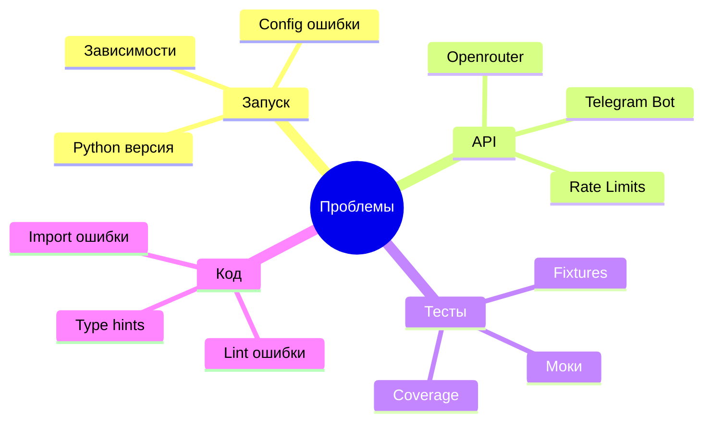

# Troubleshooting

Решение типичных проблем.

## Категории проблем



## Проблемы запуска

### Бот не запускается

#### Ошибка: "Обязательная переменная окружения не установлена"

**Симптомы**:
```
ValueError: Обязательная переменная окружения TELEGRAM_BOT_TOKEN не установлена
```

**Решение**:
1. Проверить наличие `.env` файла в корне проекта
2. Проверить что `.env` содержит `TELEGRAM_BOT_TOKEN=...`
3. Проверить что токен скопирован полностью (без пробелов)

**Проверка**:
```bash
cat .env | grep TELEGRAM_BOT_TOKEN
```

---

#### Ошибка: "Файл системного промпта не найден"

**Симптомы**:
```
ValueError: Файл системного промпта не найден: prompts/music_consultant.txt
```

**Решение**:
1. Проверить наличие файла:
```bash
ls prompts/music_consultant.txt
```

2. Если файла нет - создать:
```bash
mkdir -p prompts
echo "Ты эксперт-консультант..." > prompts/music_consultant.txt
```

3. Или использовать env вместо файла:
```env
# В .env
SYSTEM_PROMPT=Ты эксперт-консультант по музыке
# Закомментировать SYSTEM_PROMPT_FILE
```

---

#### Ошибка: "No module named 'src'"

**Симптомы**:
```
ModuleNotFoundError: No module named 'src'
```

**Решение**:
1. Убедиться что запускаете из корня проекта:
```bash
pwd  # должно показать .../telegram-bot
```

2. Запускать через `python -m`:
```bash
uv run python -m src.main  # ✅ Правильно
uv run python src/main.py  # ❌ Неправильно
```

---

#### Ошибка: "Python version mismatch"

**Симптомы**:
```
This project requires Python 3.11+
```

**Решение**:
1. Проверить версию Python:
```bash
python --version
```

2. Установить Python 3.11+:
- Ubuntu/Debian: `sudo apt install python3.11`
- macOS: `brew install python@3.11`
- Windows: скачать с python.org

3. Переустановить зависимости:
```bash
uv sync
```

## Проблемы с API

### Telegram Bot API

#### Ошибка: "Unauthorized"

**Симптомы**:
```
TelegramUnauthorizedError: 401: Unauthorized
```

**Решение**:
1. Проверить токен бота в `.env`
2. Получить новый токен от [@BotFather](https://t.me/BotFather):
   - Отправить `/mybots`
   - Выбрать бота
   - API Token → скопировать

3. Обновить `.env` и перезапустить

**Проверка токена**:
```bash
TOKEN="123456:ABC..."
curl "https://api.telegram.org/bot$TOKEN/getMe"
```

---

#### Бот не отвечает на сообщения

**Симптомы**: Бот онлайн, но не реагирует

**Решение**:

1. **Проверить логи**:
```bash
make run
# Отправить сообщение
# Проверить появился ли "message_received" в логах
```

2. **Проверить что бот не заблокирован**:
- Открыть чат с ботом
- Если внизу кнопка "Restart" - нажать

3. **Проверить фильтры**:
- Бот игнорирует сообщения без текста (медиафайлы)
- Отправить текстовое сообщение

---

### Openrouter API

#### Ошибка: "Invalid API key"

**Симптомы**:
```
OpenAIError: Invalid API key
```

**Решение**:
1. Проверить `OPENAI_API_KEY` в `.env`
2. Создать новый ключ на https://openrouter.ai/keys
3. Обновить `.env` и перезапустить

**Проверка ключа**:
```bash
curl https://openrouter.ai/api/v1/auth/key \
  -H "Authorization: Bearer $OPENAI_API_KEY"
```

---

#### Ошибка: "Insufficient credits"

**Симптомы**:
```
OpenAIError: Insufficient credits
```

**Решение**:
1. Проверить баланс: https://openrouter.ai/credits
2. Пополнить баланс
3. Или переключиться на бесплатные модели:
```env
OPENAI_MODEL=meta-llama/llama-3-8b-instruct:free
```

---

#### Ошибка: "Rate limit exceeded"

**Симптомы**:
```
OpenAIError: Rate limit exceeded
```

**Решение**:
1. Подождать 1 минуту
2. Проверить тарифный план на openrouter.ai
3. Уменьшить частоту запросов

---

#### Ошибка: "Timeout"

**Симптомы**:
```
TimeoutError: Request timeout
```

**Решение**:
1. Проверить интернет соединение
2. Попробовать другую модель (быстрее отвечает):
```env
OPENAI_MODEL=openai/gpt-3.5-turbo
```

3. Проверить статус Openrouter: https://status.openrouter.ai/

## Проблемы с тестами

### Тесты падают

#### Ошибка: "No module named 'pytest'"

**Симптомы**:
```
ModuleNotFoundError: No module named 'pytest'
```

**Решение**:
```bash
uv sync  # установить dev зависимости
make test
```

---

#### Ошибка: "Fixture not found"

**Симптомы**:
```
fixture 'config' not found
```

**Решение**:
1. Проверить наличие `tests/conftest.py`
2. Проверить что fixture определен:
```python
# tests/conftest.py
@pytest.fixture
def config(monkeypatch):
    ...
```

---

#### Тесты проходят локально, но падают в CI

**Симптомы**: `make test` работает, но GitHub Actions падает

**Решение**:
1. Проверить что используются моки для .env
2. Проверить что все зависимости в `pyproject.toml`
3. Локально очистить кеш:
```bash
rm -rf .pytest_cache
rm -rf __pycache__
make test
```

---

### Coverage не достигается

**Симптомы**:
```
FAIL Required test coverage of 60% not reached. Total coverage: 55%
```

**Решение**:
1. Посмотреть какие строки не покрыты:
```bash
make test-cov
# Смотреть колонку "Missing"
```

2. Добавить тесты для непокрытых строк

3. Если строки нельзя покрыть (error handling):
```python
# pragma: no cover
if __name__ == "__main__":  # pragma: no cover
    main()
```

## Проблемы с кодом

### Lint ошибки

#### Ошибка: "Undefined name"

**Симптомы**:
```
F821 Undefined name 'Message'
```

**Решение**:
```python
# Добавить импорт
from aiogram.types import Message
```

---

#### Ошибка: "Unused import"

**Симптомы**:
```
F401 'os' imported but unused
```

**Решение**:
```bash
make fix  # автоматически удалит неиспользуемые импорты
```

---

#### Ошибка: "Line too long"

**Симптомы**:
```
E501 line too long (130 > 120 characters)
```

**Решение**:
Разбить строку:
```python
# ❌ Слишком длинная
response = await client.chat.completions.create(model="openai/gpt-4", messages=[{"role": "user", "content": "long text"}])

# ✅ Правильно
response = await client.chat.completions.create(
    model="openai/gpt-4",
    messages=[{"role": "user", "content": "long text"}]
)
```

---

### Mypy ошибки

#### Ошибка: "Missing type annotation"

**Симптомы**:
```
error: Function is missing a type annotation
```

**Решение**:
```python
# ❌ Неправильно
def get_history(self, user_id):
    ...

# ✅ Правильно
def get_history(self, user_id: int) -> list[dict[str, Any]]:
    ...
```

---

#### Ошибка: "Incompatible return value type"

**Симптомы**:
```
error: Incompatible return value type (got "None", expected "str")
```

**Решение**:
1. Изменить возвращаемый тип:
```python
def method(self) -> str | None:  # может вернуть None
    ...
```

2. Или гарантировать возврат:
```python
def method(self) -> str:
    result = self._get_result()
    return result or ""  # гарантированно str
```

## Проблемы с логами

### Логи не появляются

**Симптомы**: Бот работает, но логов нет

**Решение**:
1. Проверить `LOG_LEVEL` в `.env`:
```env
LOG_LEVEL=DEBUG  # максимальная детализация
```

2. Проверить что директория `logs/` создана:
```bash
ls -la logs/
```

3. Проверить stdout (консоль) - логи должны быть там

---

### Логи на русском нечитаемы

**Симптомы**: Логи в виде `\u0440\u0443\u0441`

**Решение**:
1. Проверить кодировку терминала
2. Использовать UTF-8:
```bash
export LANG=en_US.UTF-8
make run
```

## Проблемы с производительностью

### Бот медленно отвечает

**Симптомы**: Задержка > 10 секунд

**Решение**:
1. Проверить модель (gpt-4 медленнее gpt-3.5):
```env
OPENAI_MODEL=openai/gpt-3.5-turbo  # быстрее
```

2. Проверить длину истории:
```env
MAX_CONTEXT_MESSAGES=5  # ограничить контекст
```

3. Проверить логи на наличие ошибок/ретраев

---

### Память растет

**Симптомы**: RSS memory растет со временем

**Решение**:
1. Ограничить контекст:
```env
MAX_CONTEXT_MESSAGES=10
```

2. Периодически очищать старые диалоги (добавить в код):
```python
# Очистка диалогов старше N дней
def cleanup_old_dialogs(self):
    # TODO: реализовать
    ...
```

## Debug режим

### Включение детальных логов

**1. Изменить .env**:
```env
LOG_LEVEL=DEBUG
```

**2. Перезапустить бота**:
```bash
make run
```

**3. Отправить сообщение и проверить логи**:
- Видны все параметры запроса
- Видна полная история диалога
- Видны детали ответа

### Пошаговая отладка

**1. Добавить логирование**:
```python
self.logger.debug("step_1", data=some_data)
# ... код
self.logger.debug("step_2", result=result)
```

**2. Запустить и проверить последовательность**

## Получение помощи

### 1. Проверить документацию

- [Getting Started](00_getting_started.md) - базовая настройка
- [Configuration](05_configuration_secrets.md) - конфигурация
- [Testing](07_testing_guide.md) - проблемы с тестами

### 2. Проверить логи

```bash
# Консоль
make run

# Файлы (если настроено)
tail -f logs/*.log
```

### 3. Проверить issues

GitHub/GitLab issues - возможно проблема уже известна

### 4. Создать issue

**Шаблон**:
```markdown
## Описание проблемы
[Краткое описание]

## Шаги воспроизведения
1. Запустить бота
2. Отправить `/start`
3. ...

## Ожидаемое поведение
Бот должен ответить "Привет!"

## Фактическое поведение
Бот не отвечает, в логах ошибка:
```
[лог ошибки]
```

## Окружение
- OS: Ubuntu 22.04
- Python: 3.11.5
- uv: 0.5.0

## Дополнительная информация
[Скриншоты, логи, конфигурация (без секретов)]
```

## Чеклист диагностики

Перед обращением за помощью:

- [ ] Проверил `.env` файл (все обязательные параметры)
- [ ] Запустил `make lint` (0 ошибок)
- [ ] Запустил `make test` (все тесты проходят)
- [ ] Проверил логи (консоль + logs/)
- [ ] Проверил версию Python (3.11+)
- [ ] Проверил зависимости (`uv sync`)
- [ ] Попробовал в debug режиме (`LOG_LEVEL=DEBUG`)
- [ ] Прочитал документацию по проблеме

## Следующие шаги

- Изучить [Configuration](05_configuration_secrets.md) для настройки
- Прочитать [Development Workflow](06_development_workflow.md) для разработки
- Посмотреть [Testing Guide](07_testing_guide.md) для тестирования
