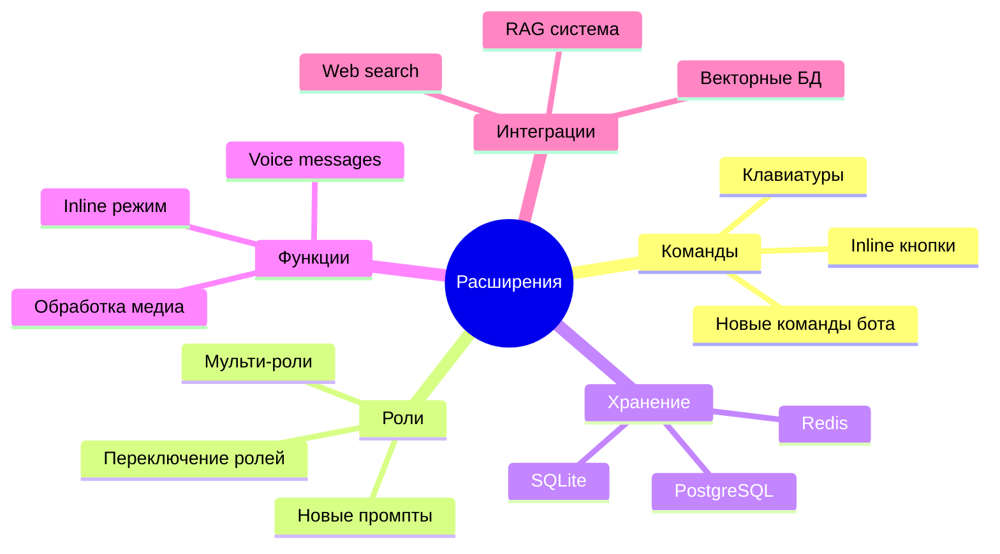

# Extending Project

Как расширять функциональность проекта.

## Типичные расширения



## Добавление новой команды

### Простая команда

**Задача**: Добавить команду `/about` с информацией о боте

**1. Создать обработчик**:
```python
# src/handler.py
async def handle_about(self, message: Message) -> None:
    """Обработчик команды /about

    Args:
        message: Входящее сообщение
    """
    about_text = (
        "🤖 Telegram LLM Bot\n\n"
        f"Модель: {self.dialog_manager.config.OPENAI_MODEL}\n"
        f"Роль: {self.dialog_manager.config.BOT_ROLE_NAME}"
    )
    await message.answer(about_text)
```

**2. Зарегистрировать команду**:
```python
# src/handler.py в методе _register_handlers()
self.router.message.register(self.handle_about, Command("about"))
```

**3. Добавить тест**:
```python
# tests/integration/test_handler.py
@pytest.mark.asyncio
async def test_handle_about_sends_info(handler):
    """Тест: handle_about отправляет информацию о боте"""
    mock_message = AsyncMock()

    await handler.handle_about(mock_message)

    mock_message.answer.assert_called_once()
    call_args = mock_message.answer.call_args[0][0]
    assert "Telegram LLM Bot" in call_args
```

**4. Проверить**:
```bash
make lint
make test
make run
# Отправить /about
```

---

### Команда с параметрами

**Задача**: Добавить команду `/model <model_name>` для смены модели

**1. Создать обработчик**:
```python
async def handle_model(self, message: Message) -> None:
    """Обработчик команды /model

    Args:
        message: Входящее сообщение
    """
    if not message.text:
        return

    parts = message.text.split(maxsplit=1)
    if len(parts) < 2:
        await message.answer("Использование: /model <model_name>")
        return

    model_name = parts[1]
    # Изменить модель (нужно добавить метод в Config)
    self.llm_client.config.OPENAI_MODEL = model_name
    await message.answer(f"Модель изменена на: {model_name}")
```

**2. Зарегистрировать**:
```python
self.router.message.register(self.handle_model, Command("model"))
```

## Добавление новой роли

### Создание нового промпта

**Задача**: Добавить роль "Переводчик"

**1. Создать файл промпта**:
```bash
cat > prompts/translator.txt << 'EOF'
Ты профессиональный переводчик.

Твои задачи:
- Переводить текст между языками
- Сохранять стиль и тон оригинала
- Объяснять сложные выражения и идиомы
- Предлагать альтернативные варианты перевода

Отвечай кратко и точно.
EOF
```

**2. Изменить конфигурацию**:
```env
# .env
SYSTEM_PROMPT_FILE=prompts/translator.txt
BOT_ROLE_NAME=Переводчик 🌐
BOT_ROLE_DESCRIPTION=Перевожу тексты между языками, объясняю идиомы
```

**3. Перезапустить бота**:
```bash
make run
```

**4. Очистить историю**:
```
/clear
Переведи на английский: Привет, как дела?
```

---

### Переключение между ролями

**Задача**: Команда `/switch_role <role_name>` для смены роли

**1. Хранить промпты**:
```python
# src/config.py
AVAILABLE_ROLES = {
    "music": "prompts/music_consultant.txt",
    "translator": "prompts/translator.txt",
    "coder": "prompts/code_assistant.txt"
}
```

**2. Метод загрузки роли**:
```python
# src/dialog_manager.py
def switch_role(self, user_id: int, role_file: str) -> None:
    """Сменить роль для пользователя

    Args:
        user_id: ID пользователя
        role_file: Путь к файлу промпта
    """
    with open(role_file, encoding="utf-8") as f:
        new_prompt = f.read().strip()

    # Очистить историю и создать новую с новым промптом
    self.dialogs[user_id] = [{"role": "system", "content": new_prompt}]
```

**3. Обработчик команды**:
```python
async def handle_switch_role(self, message: Message) -> None:
    if not message.text or not message.from_user:
        return

    parts = message.text.split(maxsplit=1)
    if len(parts) < 2:
        available = ", ".join(self.config.AVAILABLE_ROLES.keys())
        await message.answer(f"Использование: /switch_role <role>\nДоступно: {available}")
        return

    role_name = parts[1]
    if role_name not in self.config.AVAILABLE_ROLES:
        await message.answer(f"Роль '{role_name}' не найдена")
        return

    role_file = self.config.AVAILABLE_ROLES[role_name]
    self.dialog_manager.switch_role(message.from_user.id, role_file)
    await message.answer(f"Роль изменена на: {role_name}")
```

## Добавление хранилища

### Миграция на SQLite

**Задача**: Сохранять историю в SQLite вместо памяти

**1. Добавить зависимость**:
```bash
uv add aiosqlite
```

**2. Создать repository**:
```python
# src/dialog_repository.py
import aiosqlite
from typing import Any

class DialogRepository:
    """Хранилище диалогов в SQLite"""

    def __init__(self, db_path: str) -> None:
        self.db_path = db_path

    async def init_db(self) -> None:
        """Инициализация БД"""
        async with aiosqlite.connect(self.db_path) as db:
            await db.execute("""
                CREATE TABLE IF NOT EXISTS messages (
                    id INTEGER PRIMARY KEY AUTOINCREMENT,
                    user_id INTEGER NOT NULL,
                    role TEXT NOT NULL,
                    content TEXT NOT NULL,
                    created_at TIMESTAMP DEFAULT CURRENT_TIMESTAMP
                )
            """)
            await db.commit()

    async def get_history(self, user_id: int) -> list[dict[str, Any]]:
        """Получить историю пользователя"""
        async with aiosqlite.connect(self.db_path) as db:
            db.row_factory = aiosqlite.Row
            async with db.execute(
                "SELECT role, content FROM messages WHERE user_id = ? ORDER BY id",
                (user_id,)
            ) as cursor:
                rows = await cursor.fetchall()
                return [dict(row) for row in rows]

    async def add_message(self, user_id: int, role: str, content: str) -> None:
        """Добавить сообщение"""
        async with aiosqlite.connect(self.db_path) as db:
            await db.execute(
                "INSERT INTO messages (user_id, role, content) VALUES (?, ?, ?)",
                (user_id, role, content)
            )
            await db.commit()

    async def clear_history(self, user_id: int) -> None:
        """Очистить историю"""
        async with aiosqlite.connect(self.db_path) as db:
            await db.execute("DELETE FROM messages WHERE user_id = ?", (user_id,))
            await db.commit()
```

**3. Обновить DialogManager**:
```python
# src/dialog_manager.py
class DialogManager:
    def __init__(self, config: Config, repository: DialogRepository) -> None:
        self.config = config
        self.repository = repository

    async def get_history(self, user_id: int) -> list[dict[str, Any]]:
        history = await self.repository.get_history(user_id)

        # Если истории нет - инициализировать с системным промптом
        if not history:
            await self.repository.add_message(
                user_id, "system", self.config.SYSTEM_PROMPT
            )
            history = [{"role": "system", "content": self.config.SYSTEM_PROMPT}]

        # Применить обрезку контекста
        if self.config.MAX_CONTEXT_MESSAGES > 0:
            history = self._trim_history(history)

        return history
```

**4. Обновить main.py**:
```python
async def main() -> None:
    config = Config()
    logger = setup_logging(config)

    # Инициализация БД
    repository = DialogRepository("data/dialogs.db")
    await repository.init_db()

    # Создать DialogManager с repository
    dialog_manager = DialogManager(config, repository)

    # ... остальное без изменений
```

**5. Добавить в .env**:
```env
DATABASE_PATH=data/dialogs.db
```

## Обработка медиафайлов

### Voice messages

**Задача**: Обрабатывать голосовые сообщения

**1. Установить зависимости**:
```bash
uv add openai-whisper pydub
```

**2. Создать обработчик голоса**:
```python
# src/voice_handler.py
import whisper
from aiogram.types import Message

class VoiceHandler:
    """Обработчик голосовых сообщений"""

    def __init__(self, model_name: str = "base") -> None:
        self.model = whisper.load_model(model_name)

    async def transcribe(self, voice_file: str) -> str:
        """Транскрибировать голосовое сообщение

        Args:
            voice_file: Путь к аудио файлу

        Returns:
            Текст транскрипции
        """
        result = self.model.transcribe(voice_file)
        return result["text"]
```

**3. Добавить обработчик в MessageHandler**:
```python
async def handle_voice(self, message: Message) -> None:
    """Обработчик голосовых сообщений"""
    if not message.voice or not message.from_user:
        return

    # Скачать файл
    file_id = message.voice.file_id
    file = await self.bot.get_file(file_id)
    file_path = f"temp/{file_id}.ogg"
    await self.bot.download_file(file.file_path, file_path)

    # Транскрибировать
    text = await self.voice_handler.transcribe(file_path)

    # Обработать как текстовое сообщение
    message.text = text
    await self.handle_text(message)
```

**4. Зарегистрировать**:
```python
self.router.message.register(self.handle_voice, F.voice)
```

## Интеграции

### Векторная БД (RAG)

**Задача**: Добавить поиск по документам

**1. Установить ChromaDB**:
```bash
uv add chromadb
```

**2. Создать VectorStore**:
```python
# src/vector_store.py
import chromadb
from chromadb.utils import embedding_functions

class VectorStore:
    """Хранилище векторов для RAG"""

    def __init__(self, collection_name: str = "documents") -> None:
        self.client = chromadb.Client()
        self.embedding_fn = embedding_functions.SentenceTransformerEmbeddingFunction()
        self.collection = self.client.get_or_create_collection(
            name=collection_name,
            embedding_function=self.embedding_fn
        )

    def add_documents(self, documents: list[str], ids: list[str]) -> None:
        """Добавить документы"""
        self.collection.add(documents=documents, ids=ids)

    def search(self, query: str, n_results: int = 3) -> list[str]:
        """Поиск релевантных документов"""
        results = self.collection.query(
            query_texts=[query],
            n_results=n_results
        )
        return results["documents"][0]
```

**3. Использовать в MessageHandler**:
```python
async def handle_text(self, message: Message) -> None:
    # ... валидация

    # Поиск релевантных документов
    context_docs = self.vector_store.search(message.text)

    # Добавить контекст в промпт
    context = "\n\n".join(context_docs)
    enriched_message = f"Контекст:\n{context}\n\nВопрос: {message.text}"

    # Обычная обработка с обогащенным сообщением
    self.dialog_manager.add_message(user_id, "user", enriched_message)
    # ...
```

## Обновление документации

### При добавлении функции

**Обновить**:
1. `README.md` - если команды изменились
2. `.env.example` - если новые параметры
3. `docs/vision.md` - если архитектура изменилась
4. Гайды в `docs/guides/` - если workflow изменился

**Создать**:
- Новый гайд если функция большая
- Примеры использования
- Troubleshooting секцию

## Best Practices

### 1. Следовать архитектуре

✅ **Делать**: Новая функция = новый класс в отдельном файле

❌ **Не делать**: Добавлять всё в `handler.py`

### 2. Добавлять тесты

✅ **Делать**: TDD для новых компонентов

```python
# Сначала тест
def test_new_feature():
    assert new_feature() == expected

# Потом реализация
def new_feature():
    return expected
```

### 3. Обновлять конфигурацию

✅ **Делать**: Новые параметры через `.env`

```python
# src/config.py
self.NEW_PARAM = os.getenv("NEW_PARAM", "default")
```

```env
# .env.example
NEW_PARAM=example_value
```

### 4. Документировать

✅ **Делать**: Docstrings для всех публичных методов

```python
def new_method(self, param: str) -> int:
    """Краткое описание

    Args:
        param: Описание параметра

    Returns:
        Описание возвращаемого значения
    """
    ...
```

## Следующие шаги

- Прочитать [Architecture Overview](01_architecture_overview.md) для понимания структуры
- Изучить [Development Workflow](06_development_workflow.md) для процесса разработки
- Посмотреть [Testing Guide](07_testing_guide.md) для написания тестов
- Прочитать [Code Review Guide](08_code_review_guide.md) для проверки качества
