# Visual Project Overview

Визуализация проекта с разных точек зрения.

## Оглавление

1. [Архитектура системы](#архитектура-системы)
2. [Поток данных](#поток-данных)
3. [Граф зависимостей](#граф-зависимостей)
4. [Последовательность взаимодействий](#последовательность-взаимодействий)
5. [Жизненный цикл сообщения](#жизненный-цикл-сообщения)
6. [Структура хранения](#структура-хранения)
7. [Обработка ошибок](#обработка-ошибок)
8. [Структура проекта](#структура-проекта)
9. [Timeline разработки](#timeline-разработки)
10. [Makefile команды](#makefile-команды)

---

## Архитектура системы

### High-Level архитектура

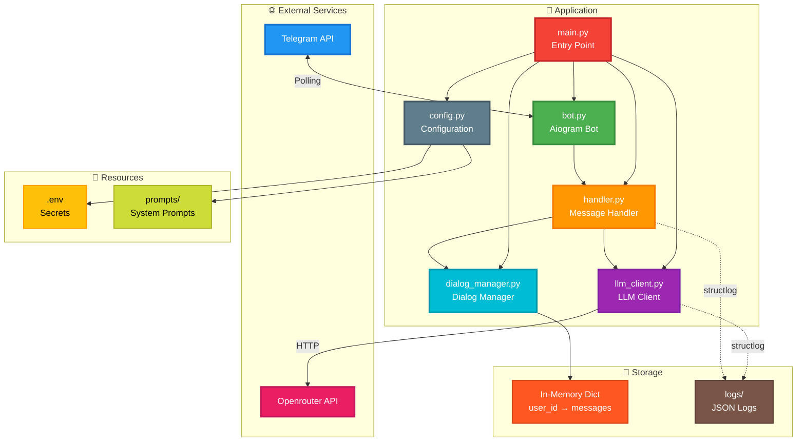

### Компонентная архитектура

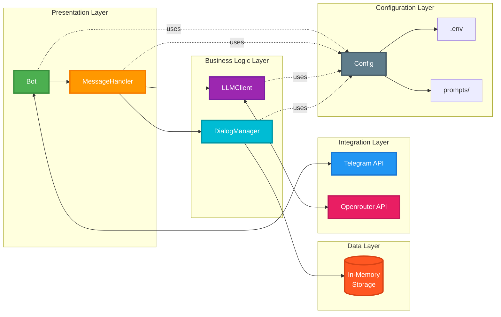

---

## Поток данных

### Обработка текстового сообщения

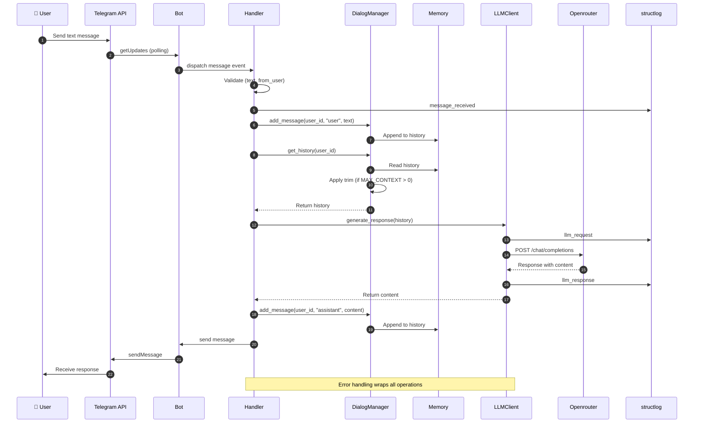

### Обработка команды /clear

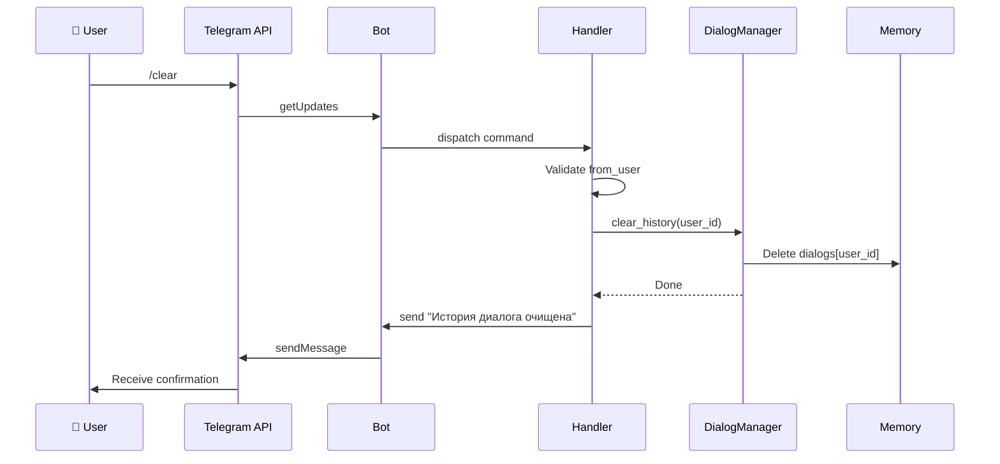

### Первое обращение пользователя

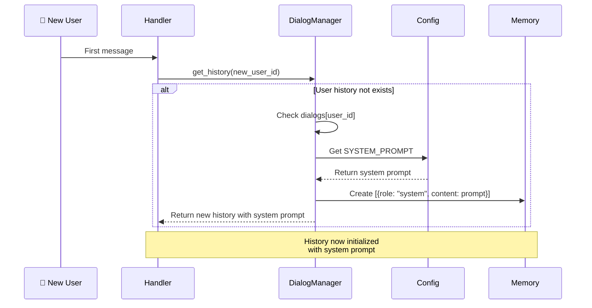

---

## Граф зависимостей

### Импорты и зависимости модулей

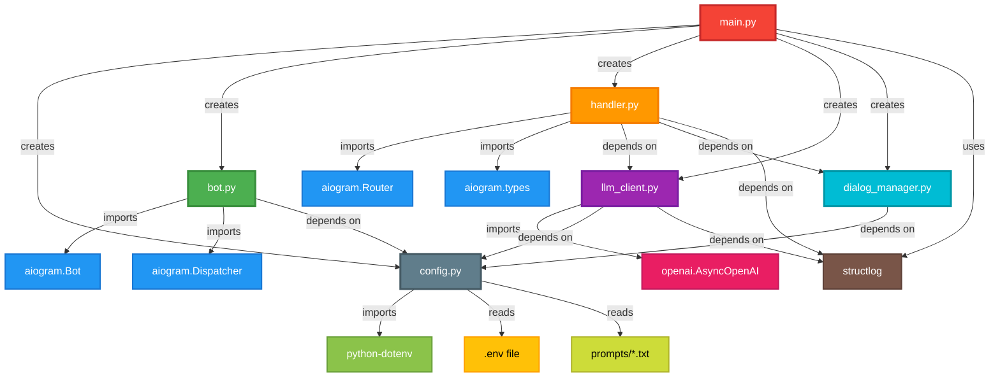

### Инъекция зависимостей (DI)

```mermaid
graph TB
    subgraph main.py
        M[main()]
    end

    M -->|1. Create| C[Config]
    M -->|2. Create| L[Logger]
    M -->|3. Create| B[Bot]
    M -->|4. Create with Config+Logger| LLC[LLMClient]
    M -->|5. Create with Config| DM[DialogManager]
    M -->|6. Create with LLC+DM+Logger| H[MessageHandler]
    M -->|7. Register| R[Router]
    M -->|8. Start| P[Polling]

    C -.->|inject| B
    C -.->|inject| LLC
    C -.->|inject| DM
    L -.->|inject| LLC
    L -.->|inject| H
    LLC -.->|inject| H
    DM -.->|inject| H

    style M fill:#F44336,stroke:#C62828,stroke-width:3px,color:#fff
    style C fill:#607D8B,stroke:#455A64,stroke-width:3px,color:#fff
    style L fill:#795548,stroke:#5D4037,stroke-width:3px,color:#fff
    style B fill:#4CAF50,stroke:#388E3C,stroke-width:3px,color:#fff
    style LLC fill:#9C27B0,stroke:#7B1FA2,stroke-width:3px,color:#fff
    style DM fill:#00BCD4,stroke:#0097A7,stroke-width:3px,color:#fff
    style H fill:#FF9800,stroke:#F57C00,stroke-width:3px,color:#fff
```

---

## Последовательность взаимодействий

### Полный цикл: от запуска до ответа

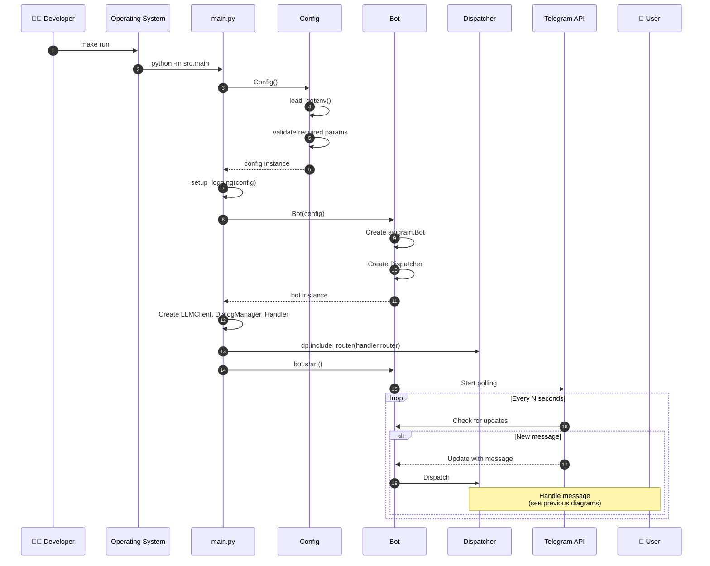

### Обработка ошибок в LLM

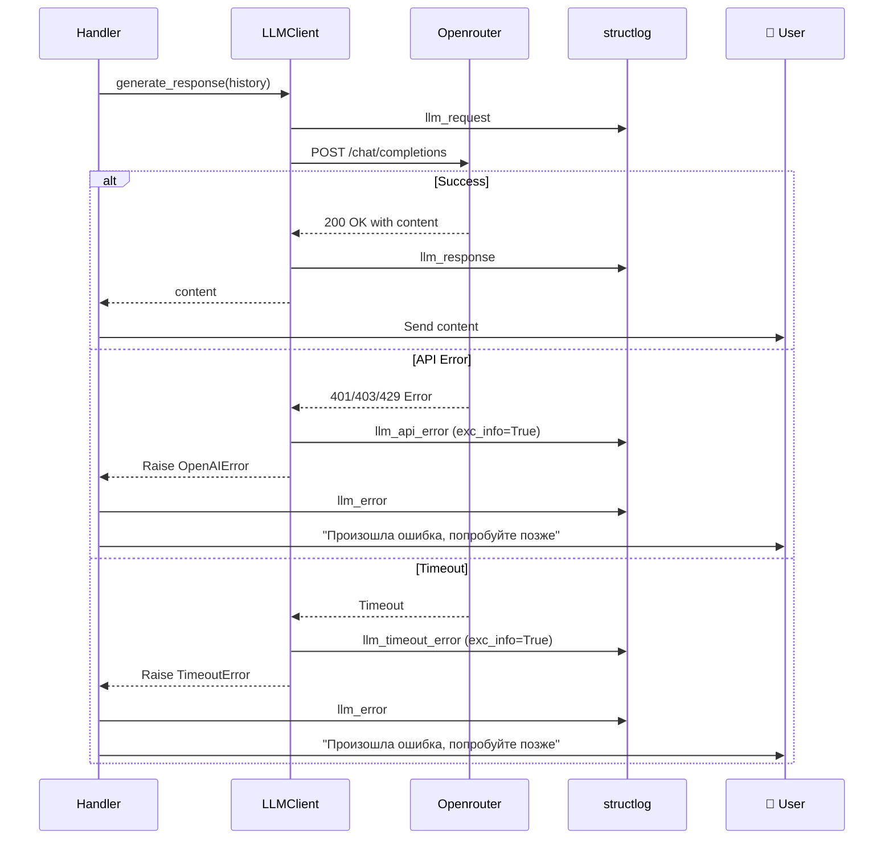

---

## Жизненный цикл сообщения

### Состояния обработки

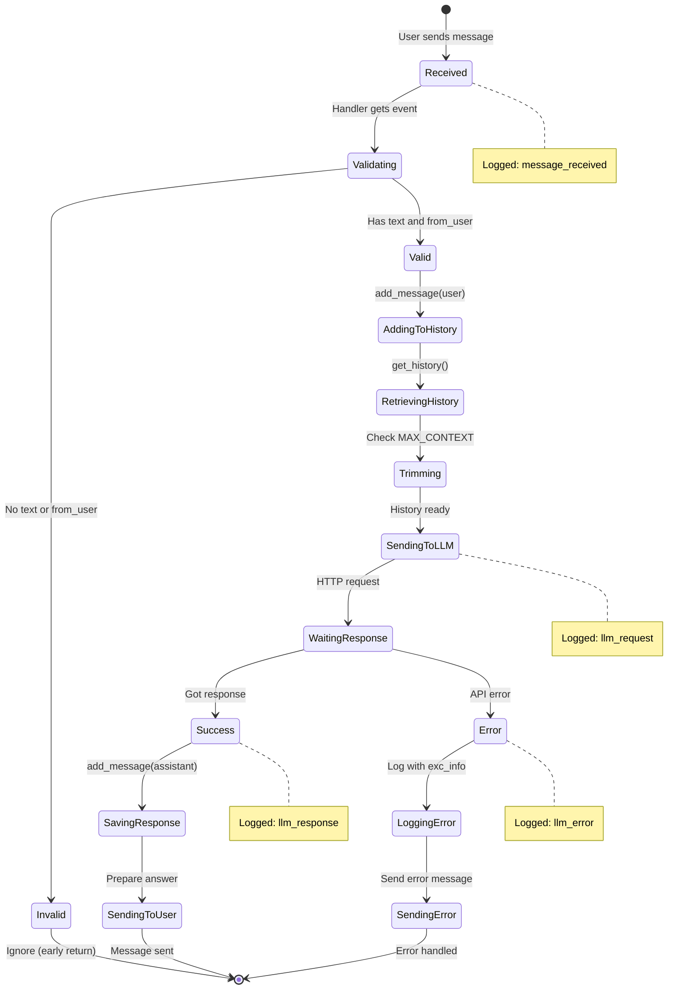

### Жизненный цикл истории диалога

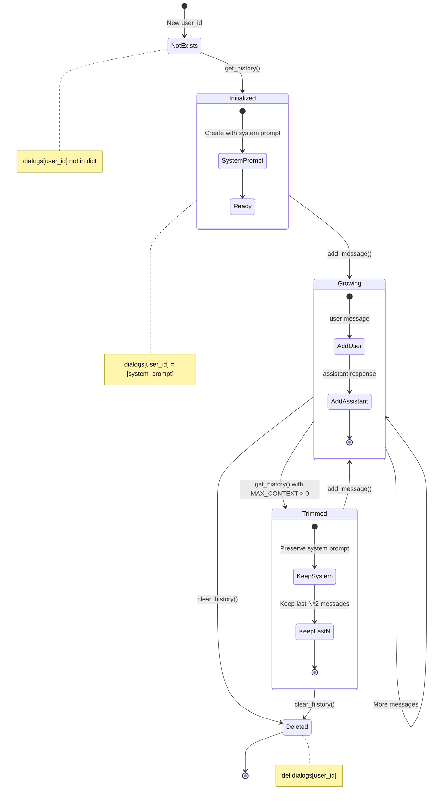

---

## Структура хранения

### In-Memory Storage структура

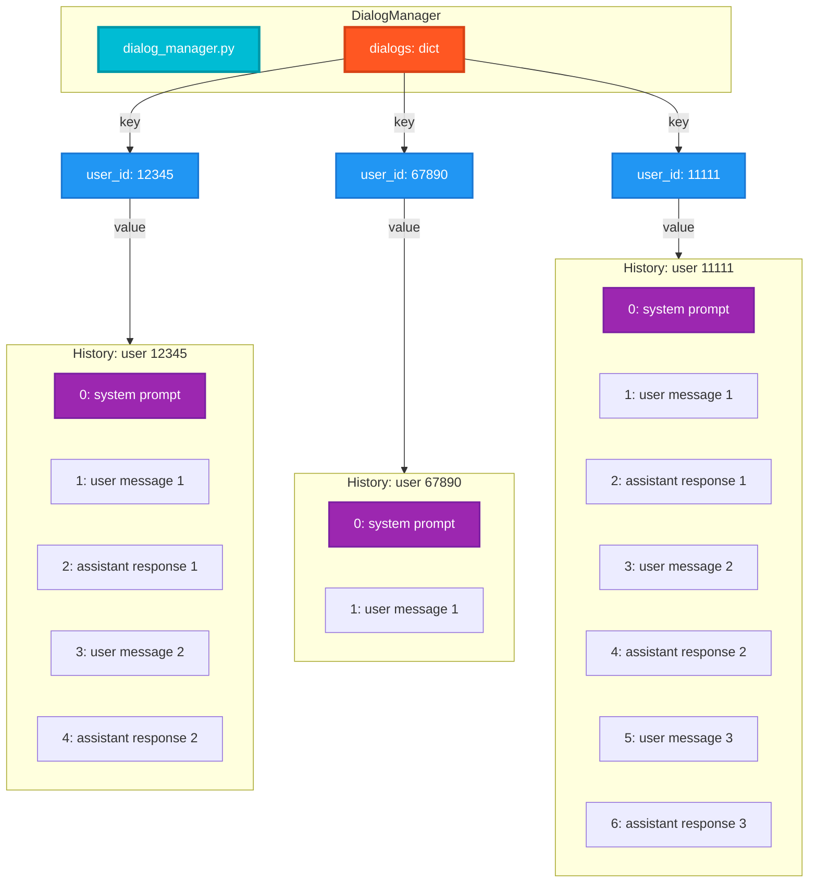

### Message формат (OpenAI API)

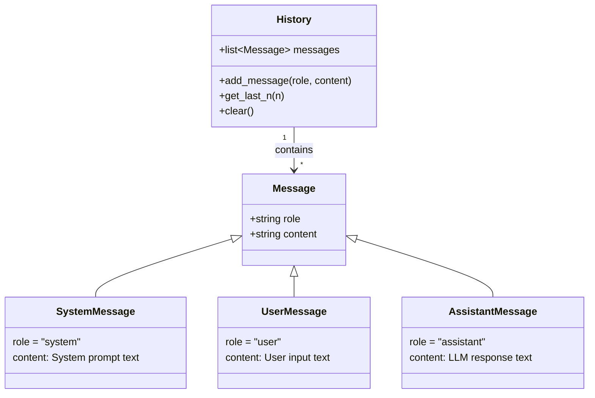

### Обрезка контекста (Trimming)

```mermaid
flowchart TD
    Start[get_history] --> Check{MAX_CONTEXT > 0?}

    Check -->|No| Return[Return full history]
    Check -->|Yes| Trim[_trim_history]

    Trim --> ExtractSystem[Extract system prompt<br/>history0]
    ExtractSystem --> ExtractDialog[Extract dialog messages<br/>history1 to end]

    ExtractDialog --> CalcMax[max_dialog = MAX_CONTEXT * 2]
    CalcMax --> CheckLen{len(dialog) > max_dialog?}

    CheckLen -->|No| Combine1[system + dialog]
    CheckLen -->|Yes| Slice[dialog = dialog-max_dialog:]

    Slice --> Combine2[system + last N*2 messages]

    Combine1 --> ReturnTrimmed[Return history]
    Combine2 --> ReturnTrimmed
    Return --> End[End]
    ReturnTrimmed --> End

    style Start fill:#4CAF50,stroke:#388E3C,stroke-width:3px,color:#fff
    style Trim fill:#FF9800,stroke:#F57C00,stroke-width:3px,color:#fff
    style ReturnTrimmed fill:#2196F3,stroke:#1976D2,stroke-width:3px,color:#fff
    style End fill:#9C27B0,stroke:#7B1FA2,stroke-width:3px,color:#fff
```

---

## Обработка ошибок

### Стратегия обработки ошибок

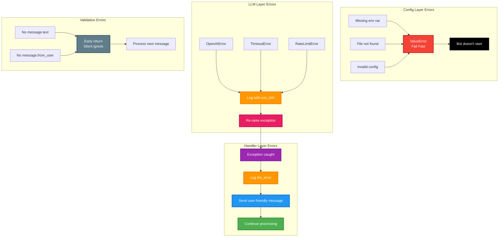

### Обработка ошибок по слоям

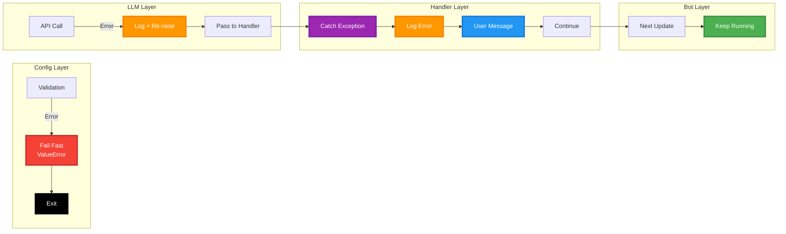

---

## Структура проекта

### Mindmap структуры

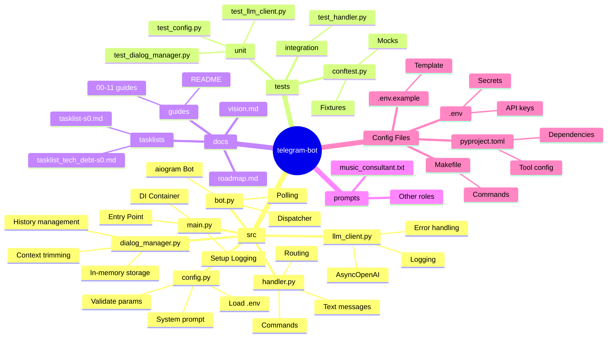

### Дерево файловой системы

```mermaid
graph TB
    Root[telegram-bot/] --> Src[src/]
    Root --> Tests[tests/]
    Root --> Docs[docs/]
    Root --> Prompts[prompts/]
    Root --> Logs[logs/]
    Root --> Config[Config Files]

    Src --> S1[__init__.py]
    Src --> S2[main.py]
    Src --> S3[config.py]
    Src --> S4[bot.py]
    Src --> S5[handler.py]
    Src --> S6[llm_client.py]
    Src --> S7[dialog_manager.py]

    Tests --> T1[conftest.py]
    Tests --> TU[unit/]
    Tests --> TI[integration/]

    TU --> TU1[test_config.py]
    TU --> TU2[test_dialog_manager.py]
    TU --> TU3[test_llm_client.py]

    TI --> TI1[test_handler.py]

    Docs --> D1[guides/]
    Docs --> D2[vision.md]
    Docs --> D3[roadmap.md]
    Docs --> D4[tasklists/]

    D1 --> G1[00-11 guides]
    D1 --> G2[README.md]

    D4 --> TL1[tasklist-s0.md]
    D4 --> TL2[tasklist_tech_debt-s0.md]

    Prompts --> P1[music_consultant.txt]

    Config --> C1[.env]
    Config --> C2[.env.example]
    Config --> C3[pyproject.toml]
    Config --> C4[Makefile]
    Config --> C5[README.md]

    style Root fill:#F44336,stroke:#C62828,stroke-width:3px,color:#fff
    style Src fill:#4CAF50,stroke:#388E3C,stroke-width:3px,color:#fff
    style Tests fill:#2196F3,stroke:#1976D2,stroke-width:3px,color:#fff
    style Docs fill:#FF9800,stroke:#F57C00,stroke-width:3px,color:#fff
    style Prompts fill:#9C27B0,stroke:#7B1FA2,stroke-width:3px,color:#fff
    style Logs fill:#795548,stroke:#5D4037,stroke-width:3px,color:#fff
    style Config fill:#607D8B,stroke:#455A64,stroke-width:3px,color:#fff
```

---

## Timeline разработки

### История итераций

```mermaid
timeline
    title Развитие проекта
    section Phase 1: MVP
        Итерация 1 (2025-10-10) : Инициализация проекта
                                 : Config + .env
                                 : uv + Makefile
        Итерация 2 (2025-10-10) : Базовый бот
                                 : aiogram setup
                                 : /start команда
        Итерация 3 (2025-10-10) : LLM интеграция
                                 : LLMClient
                                 : Openrouter API
    section Phase 2: Core Features
        Итерация 4 (2025-10-11) : История диалогов
                                 : DialogManager
                                 : /clear команда
        Итерация 5 (2025-10-11) : Логирование
                                 : structlog
                                 : Error handling
        Итерация 6 (2025-10-11) : /role команда
                                 : TDD workflow
                                 : BOT_ROLE_* params
        Итерация 7 (2025-10-11) : Промпты из файлов
                                 : prompts/ директория
                                 : SYSTEM_PROMPT_FILE
    section Phase 3: Quality
        Tech Debt 1 (2025-10-11) : Критичные фиксы
                                  : Валидация
                                  : Context trimming
        Tech Debt 2 (2025-10-11) : Инструменты
                                  : ruff + mypy
                                  : Makefile commands
        Tech Debt 3 (2025-10-11) : Тестирование
                                  : pytest setup
                                  : Unit + Integration
```

### Roadmap (текущее состояние)

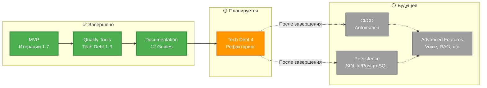

---

## Makefile команды

### Граф команд и зависимостей

```mermaid
graph TB
    subgraph Development["Development Commands"]
        Install[make install<br/>uv sync]
        Run[make run<br/>python -m src.main]
    end

    subgraph Quality["Quality Commands"]
        Format[make format<br/>ruff format]
        Lint[make lint<br/>ruff check + mypy]
        Fix[make fix<br/>ruff --fix]
    end

    subgraph Testing["Testing Commands"]
        Test[make test<br/>pytest]
        TestCov[make test-cov<br/>pytest --cov]
    end

    subgraph Workflow["Pre-commit Workflow"]
        Code[Write Code] --> Format
        Format --> Lint
        Lint --> LintOK{Errors?}
        LintOK -->|Yes| Fix
        Fix --> Lint
        LintOK -->|No| Test
        Test --> TestOK{Pass?}
        TestOK -->|Yes| Commit[git commit]
        TestOK -->|No| Code
    end

    Install -.->|Required for| Run
    Install -.->|Required for| Format
    Install -.->|Required for| Lint
    Install -.->|Required for| Test

    style Install fill:#4CAF50,stroke:#388E3C,stroke-width:3px,color:#fff
    style Run fill:#2196F3,stroke:#1976D2,stroke-width:3px,color:#fff
    style Format fill:#9C27B0,stroke:#7B1FA2,stroke-width:3px,color:#fff
    style Lint fill:#FF9800,stroke:#F57C00,stroke-width:3px,color:#fff
    style Fix fill:#FF5722,stroke:#D84315,stroke-width:3px,color:#fff
    style Test fill:#00BCD4,stroke:#0097A7,stroke-width:3px,color:#fff
    style TestCov fill:#00BCD4,stroke:#0097A7,stroke-width:3px,color:#fff
    style Commit fill:#4CAF50,stroke:#388E3C,stroke-width:3px,color:#fff
```

### Команды по категориям

```mermaid
mindmap
  root((Makefile<br/>Commands))
    Setup
      make install
        uv sync
        Install dependencies
    Run
      make run
        python -m src.main
        Start bot
    Code Quality
      make format
        ruff format src/
        Auto-format code
      make lint
        ruff check src/
        mypy src/
        Static analysis
      make fix
        ruff --fix
        Auto-fix issues
    Testing
      make test
        pytest tests/ -v
        Run all tests
      make test-cov
        pytest --cov
        Coverage report
    Cleanup
      make clean
        Remove cache
        Remove logs
```

---

## Интеграционные точки

### Внешние API и сервисы

```mermaid
graph TB
    subgraph Bot["🤖 Telegram Bot"]
        Core[Core Application]
    end

    subgraph External["🌐 External Services"]
        TG[Telegram Bot API]
        OR[Openrouter API]
    end

    subgraph Resources["📦 Resources"]
        ENV[.env<br/>Environment]
        Files[prompts/<br/>System Prompts]
    end

    subgraph Monitoring["📊 Monitoring"]
        Logs[logs/<br/>JSON Logs]
        Console[stdout<br/>Console Output]
    end

    Core <-->|Polling<br/>getUpdates| TG
    Core <-->|HTTP POST<br/>/chat/completions| OR
    Core -->|Load| ENV
    Core -->|Read| Files
    Core -->|Write| Logs
    Core -->|Print| Console

    TG -.->|Webhook<br/>не реализовано| Core
    OR -.->|Streaming<br/>не реализовано| Core

    style Core fill:#FF5722,stroke:#D84315,stroke-width:4px,color:#fff
    style TG fill:#2196F3,stroke:#1976D2,stroke-width:3px,color:#fff
    style OR fill:#E91E63,stroke:#C2185B,stroke-width:3px,color:#fff
    style ENV fill:#FFC107,stroke:#FFA000,stroke-width:2px,color:#000
    style Files fill:#CDDC39,stroke:#AFB42B,stroke-width:2px,color:#000
    style Logs fill:#795548,stroke:#5D4037,stroke-width:2px,color:#fff
    style Console fill:#607D8B,stroke:#455A64,stroke-width:2px,color:#fff
```

### Протокол взаимодействия с Telegram

```mermaid
sequenceDiagram
    participant B as Bot (Polling)
    participant T as Telegram API

    loop Every N seconds
        B->>T: GET /getUpdates<br/>offset=last_update_id

        alt Has new updates
            T-->>B: 200 OK<br/>[{update_id, message}]
            B->>B: Process each update
            B->>B: Update offset = last_update_id + 1
        else No updates
            T-->>B: 200 OK<br/>[]
        else Error
            T-->>B: 4xx/5xx Error
            B->>B: Log error, retry
        end
    end
```

### Протокол взаимодействия с Openrouter

```mermaid
sequenceDiagram
    participant L as LLMClient
    participant O as Openrouter API

    L->>O: POST /chat/completions<br/>Authorization: Bearer key<br/>Body: {model, messages}

    alt Success
        O-->>L: 200 OK<br/>{choices: [{message: {content}}]}
        L->>L: Extract content
    else Invalid Key
        O-->>L: 401 Unauthorized
        L->>L: Raise OpenAIError
    else Rate Limit
        O-->>L: 429 Too Many Requests
        L->>L: Raise OpenAIError
    else Insufficient Credits
        O-->>L: 402 Payment Required
        L->>L: Raise OpenAIError
    else Server Error
        O-->>L: 500 Internal Server Error
        L->>L: Raise OpenAIError
    else Network Timeout
        O-->>L: Timeout
        L->>L: Raise TimeoutError
    end
```

---

## Навигация по гайдам

### Связь визуализации с документацией

```mermaid
graph TD
    Visual[12_visual_project_overview.md<br/>Эта страница]

    Visual -.->|Архитектура детально| G01[01_architecture_overview.md]
    Visual -.->|Навигация по коду| G02[02_codebase_tour.md]
    Visual -.->|Форматы данных| G03[03_data_model.md]
    Visual -.->|API интеграции| G04[04_integrations.md]
    Visual -.->|Конфигурация| G05[05_configuration_secrets.md]
    Visual -.->|Workflow разработки| G06[06_development_workflow.md]
    Visual -.->|Тестирование| G07[07_testing_guide.md]
    Visual -.->|Обработка ошибок| G10[10_troubleshooting.md]
    Visual -.->|Расширение проекта| G11[11_extending_project.md]

    style Visual fill:#F44336,stroke:#C62828,stroke-width:4px,color:#fff
    style G01 fill:#2196F3,stroke:#1976D2,stroke-width:2px,color:#fff
    style G02 fill:#4CAF50,stroke:#388E3C,stroke-width:2px,color:#fff
    style G03 fill:#FF9800,stroke:#F57C00,stroke-width:2px,color:#fff
    style G04 fill:#9C27B0,stroke:#7B1FA2,stroke-width:2px,color:#fff
    style G05 fill:#00BCD4,stroke:#0097A7,stroke-width:2px,color:#fff
    style G06 fill:#E91E63,stroke:#C2185B,stroke-width:2px,color:#fff
    style G07 fill:#FFC107,stroke:#FFA000,stroke-width:2px,color:#000
    style G10 fill:#795548,stroke:#5D4037,stroke-width:2px,color:#fff
    style G11 fill:#607D8B,stroke:#455A64,stroke-width:2px,color:#fff
```

---

## Заключение

Этот гайд предоставляет визуальное представление проекта с различных точек зрения:

✅ **Архитектурная** - компоненты и их связи
✅ **Динамическая** - потоки данных и последовательности
✅ **Структурная** - организация кода и зависимости
✅ **Состояния** - жизненные циклы объектов
✅ **Хранение** - модели данных и форматы
✅ **Обработка ошибок** - стратегии и слои
✅ **Процессы** - workflows и команды
✅ **История** - timeline развития

Для детального изучения каждого аспекта обращайтесь к соответствующим гайдам из [docs/guides/](README.md).

---

**Последнее обновление**: 2025-10-16
**Версия**: 1.0
