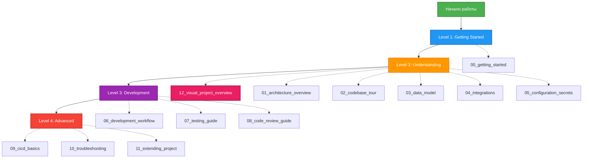

# Documentation Guides

Полный набор гайдов для работы с проектом.

## 🚀 Быстрый старт

Новичкам рекомендуется читать в следующем порядке:

1. **[Getting Started](00_getting_started.md)** - запустить проект за 10 минут
2. **[Architecture Overview](01_architecture_overview.md)** - понять структуру
3. **[Codebase Tour](02_codebase_tour.md)** - навигация по коду

## 📚 Все гайды

### Основы

| № | Гайд | Описание | Время чтения |
|---|------|----------|--------------|
| 00 | [Getting Started](00_getting_started.md) | Установка, настройка, первый запуск | 10 мин |
| 01 | [Architecture Overview](01_architecture_overview.md) | Архитектура, компоненты, flow | 15 мин |
| 02 | [Codebase Tour](02_codebase_tour.md) | Структура проекта, где что лежит | 15 мин |

### Технические детали

| № | Гайд | Описание | Время чтения |
|---|------|----------|--------------|
| 03 | [Data Model](03_data_model.md) | Структуры данных, форматы | 10 мин |
| 04 | [Integrations](04_integrations.md) | Telegram API, Openrouter, логирование | 15 мин |
| 05 | [Configuration & Secrets](05_configuration_secrets.md) | .env, API ключи, промпты | 15 мин |

### Разработка

| № | Гайд | Описание | Время чтения |
|---|------|----------|--------------|
| 06 | [Development Workflow](06_development_workflow.md) | Процесс разработки, команды, TDD | 20 мин |
| 07 | [Testing Guide](07_testing_guide.md) | Написание и запуск тестов | 20 мин |
| 08 | [Code Review Guide](08_code_review_guide.md) | Чеклист ревьюера, best practices | 15 мин |

### Операции

| № | Гайд | Описание | Время чтения |
|---|------|----------|--------------|
| 09 | [CI/CD Basics](09_cicd_basics.md) | Автоматизация, деплой, мониторинг | 15 мин |
| 10 | [Troubleshooting](10_troubleshooting.md) | Решение типичных проблем | 20 мин |
| 11 | [Extending Project](11_extending_project.md) | Добавление новых функций | 25 мин |

### Визуализация

| № | Гайд | Описание | Время чтения |
|---|------|----------|--------------|
| 12 | [Visual Project Overview](12_visual_project_overview.md) | 📊 Визуализация с разных точек зрения | 30 мин |

## 🎯 Навигация по задачам

### Я хочу...

**...запустить проект**
→ [Getting Started](00_getting_started.md)

**...понять как устроен код**
→ [Architecture Overview](01_architecture_overview.md) → [Codebase Tour](02_codebase_tour.md)

**...увидеть архитектуру визуально**
→ [Visual Project Overview](12_visual_project_overview.md)

**...изменить системный промпт**
→ [Configuration & Secrets](05_configuration_secrets.md#системный-промпт)

**...добавить новую команду**
→ [Extending Project](11_extending_project.md#добавление-новой-команды)

**...написать тесты**
→ [Testing Guide](07_testing_guide.md)

**...исправить ошибку**
→ [Troubleshooting](10_troubleshooting.md)

**...настроить CI/CD**
→ [CI/CD Basics](09_cicd_basics.md)

**...сделать code review**
→ [Code Review Guide](08_code_review_guide.md)

**...добавить БД**
→ [Extending Project](11_extending_project.md#добавление-хранилища)

## 📖 Дополнительная документация

### Корневые документы

- **[vision.md](../vision.md)** - техническое видение, архитектура, модели данных
- **[roadmap.md](../roadmap.md)** - roadmap проекта по спринтам
- **[tasklists/](../tasklists/)** - детальные планы работ по спринтам
- **[README.md](../../README.md)** - основное описание проекта

### Правила разработки

В `.cursorrules` находятся:
- Conventions - правила кодирования
- QA Conventions - правила тестирования
- Workflow - процесс выполнения работ (TDD)

## 🔧 Быстрые команды

```bash
# Установка
make install

# Запуск
make run

# Качество кода
make format    # автоформатирование
make lint      # проверка (ruff + mypy)
make fix       # автоисправление

# Тестирование
make test      # запуск тестов
make test-cov  # тесты + coverage
```

## 📊 Уровни документации



## 💡 Рекомендации

### Для новичков

**День 1**: Прочитать Getting Started, запустить проект
**День 2**: Изучить Visual Project Overview (визуализация) и Architecture Overview
**День 3**: Codebase Tour и попробовать изменить промпт, добавить команду
**Неделя 1**: Прочитать все гайды из раздела "Основы" и "Технические детали"

### Для разработчиков

**Must read**:
- Development Workflow
- Testing Guide
- Code Review Guide

**Nice to have**:
- CI/CD Basics
- Extending Project

### Для DevOps

**Focus on**:
- Configuration & Secrets
- CI/CD Basics
- Troubleshooting

## 🤝 Вклад в документацию

При изменении кода:
- Обновить соответствующий гайд
- Проверить актуальность примеров
- Добавить в Troubleshooting если нашли проблему

При добавлении функции:
- Обновить vision.md (архитектура)
- Обновить .env.example (конфигурация)
- Добавить примеры в Extending Project

## 📝 Обратная связь

Нашли ошибку в документации? Что-то непонятно?
- Создайте issue
- Предложите улучшение
- Задайте вопрос в обсуждениях

## 🎨 Визуальный обзор

Для визуального понимания проекта рекомендуется начать с:

📊 **[Visual Project Overview](12_visual_project_overview.md)** - комплексная визуализация с использованием mermaid диаграмм:
- Архитектура системы (3 разных представления)
- Потоки данных (sequence diagrams)
- Граф зависимостей
- Жизненные циклы (state diagrams)
- Структура хранения
- Обработка ошибок
- Timeline разработки
- И многое другое

---

**Последнее обновление**: 2025-10-16
**Версия гайдов**: 1.0
**Всего гайдов**: 13 (включая визуализацию)
